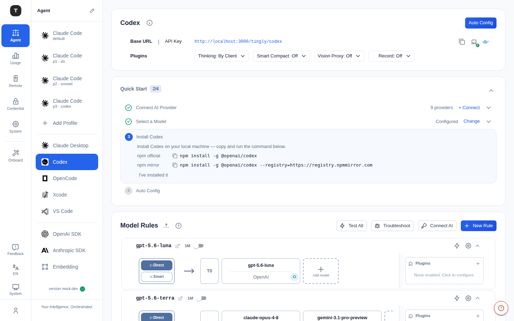

# Codex 场景

路径：`/agent/codex`

Codex 场景将 OpenAI Codex CLI 的 API 请求代理到你配置的 Provider，支持自动配置和灵活的转发规则。

---

## 页面结构

页面由以下区域从上到下依次构成：

### 1. Codex 配置卡

展示当前场景的连接信息：
- **Base URL**：Codex CLI 应配置的代理地址（含复制按钮）
- **API Key**：供 CLI 使用的令牌（含复制/显示按钮）

### 2. Agent 设置卡

- **安装命令**：提供 Codex CLI 的安装命令，支持一键复制
- **Auto Config** 按钮：自动将代理配置写入 Codex 配置文件（设置 `OPENAI_BASE_URL` 和 `OPENAI_API_KEY`）

### 3. 模型与转发规则（可折叠）

管理 Codex 场景的路由规则，支持添加、编辑和删除规则。

---

## 配置流程

1. 在 [凭证管理](./08-credentials.md) 添加至少一个 Provider
2. 打开 Codex 场景页，确认 Base URL 和 API Key
3. 安装 Codex CLI（见安装命令）
4. 点击 **Auto Config** 自动写入代理配置，或手动设置：
   - `OPENAI_BASE_URL`：填写 Base URL
   - `OPENAI_API_KEY`：填写 API Key
5. 在终端中使用 Codex CLI

---

## 相关页面

- [Claude Code 场景](./03-scenario-claude-code.md)
- [其他编程 Agent](./05-scenario-coding-agents.md)
- [凭证管理](./08-credentials.md)
