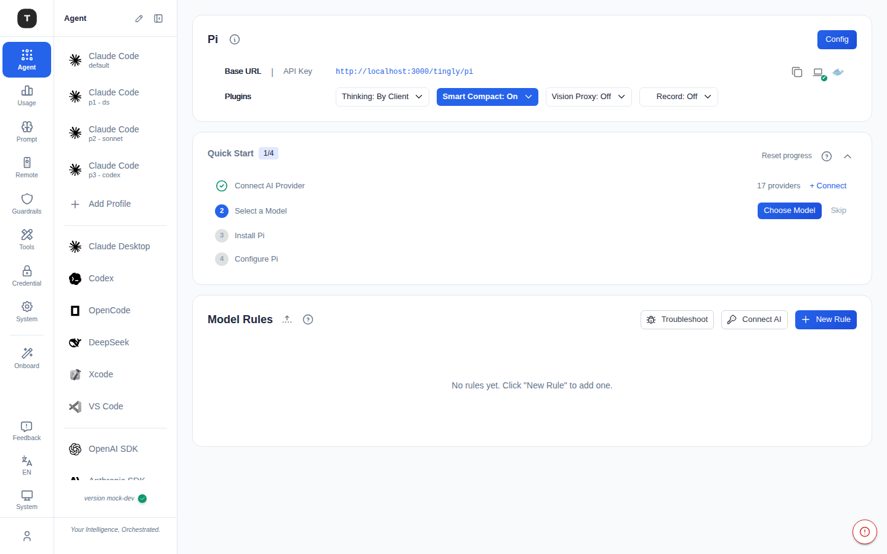
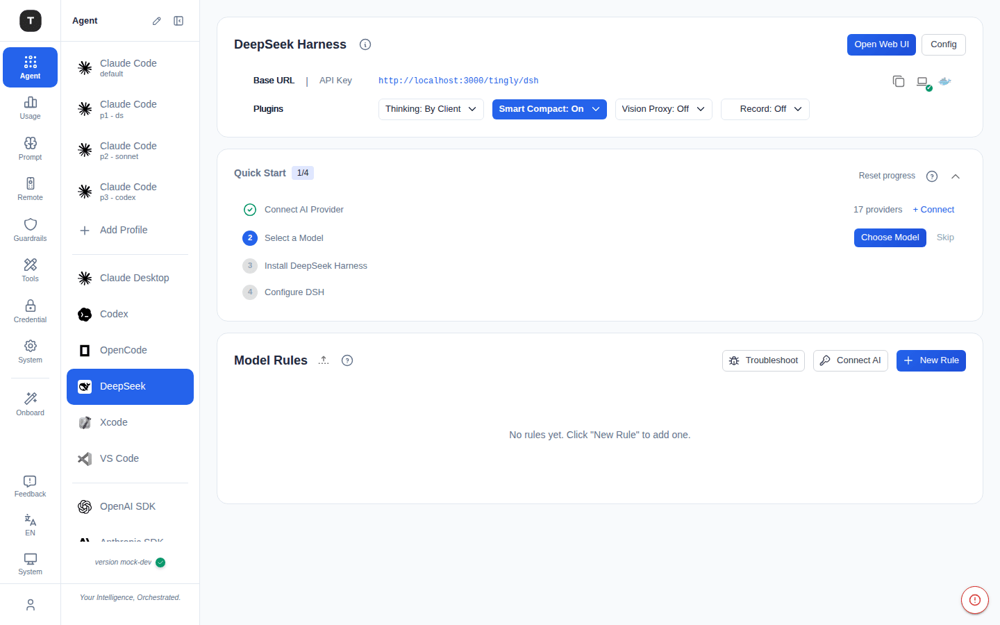

# 其他编程 Agent 场景

本章介绍除 Claude Code 和 Codex 之外的编程工具代理场景，包括 OpenCode、Pi、DeepSeek Harness、VS Code、Xcode 和 Claude Desktop。这些场景的配置结构与 Claude Code 类似。

---

## OpenCode

路径：`/agent/opencode`

代理 OpenCode CLI 的请求。页面结构与 Codex 完全一致：

- 配置卡 + 代理地址/Key
- Agent 设置 + 安装引导
- 转发规则管理

---

## Pi

路径：`/agent/pi`

代理 Pi 编程 Agent 的请求。结构与 OpenCode/Codex 相同——Quick Start 第 3 步为 **Install Pi**，第 4 步为 **Configure Pi**。

- 右上角 **Config** 打开模态框，说明如何将 Pi 的 Provider Base URL 和 API Key 指向本页展示的值——具体配置文件格式请参考 Pi 自身仓库
- 安装步骤附带 **View on GitHub** 链接

---

## DeepSeek Harness（dsh）

路径：`/agent/dsh`

代理 [DeepSeek Harness](https://github.com/deepseek-ai/dsh) 的请求——与其他基于 CLI 的场景不同，dsh 自带**自托管 Web UI**。

- 右上角（Config 旁）**Open Web UI** 按钮跳转到本地运行的 dsh Web UI，默认地址 `http://127.0.0.1:3080`。Tingly-Box **不会**代为启动 dsh，需自行先运行 `npx @deepseek-ai/dsh web`（需要 Node.js），启动后再点此按钮跳转
- Quick Start 第 3 步为 **Install DeepSeek Harness**，第 4 步为 **Configure DSH**——该步骤会将 dsh 的模型 Provider 插件指向本页的 Base URL 和 API Key
- `dsh` 处于开发者预览阶段，其配置方式可能变化

#### DSH 自动配置

Config 会向 `$DSH_HOME/settings.yaml` 写入一个 `tingly-box` provider 条目，除 Base URL/API Key 外还包含两项额外设置：

| 设置项 | 取值 | 作用 |
|--------|------|------|
| **Primary protocol（主协议）** | `openai-completions`（默认）/ `openai-responses` / `anthropic-messages` | Tingly-Box 转发给 dsh 的 `llm-pi-ai` 适配器时使用的接口格式。OpenAI Chat 是最通用的兼容格式；只有当该 provider 下的模型确实使用对应 API 时才应选择 OpenAI Responses 或 Anthropic Messages，选错会导致这些模型无法正常工作。 |
| **Supported input modality（支持的输入模态）** | `text`（默认）/ `text_image` | 控制该 provider 下的模型默认是否接收图片输入。留空/`text` 表示 dsh 按纯文本模型处理；`text_image` 则同时接受图片输入。 |

---

## VS Code

路径：`/agent/vscode`

代理 VS Code AI 扩展（如 GitHub Copilot Chat、Continue 等）的 API 请求。

### 说明

VS Code 扩展通常通过 `baseURL` 环境变量或扩展设置指定 API 端点，将其指向 Tingly-Box 提供的代理地址即可。

---

## Xcode

路径：`/agent/xcode`

代理 Apple Xcode AI 功能（Xcode Intelligence）的 API 请求。配置方式与 VS Code 类似，将 API 端点指向 Tingly-Box 提供的代理地址。

---

## Claude Desktop

路径：`/agent/claude_desktop`

代理 Claude 桌面客户端（Desktop App）的 API 请求。

### 页面结构

1. **Claude Desktop 配置卡**：展示代理地址和 API Key
2. **Config 模态框**：提供完整的 `claude_desktop_config.json` 配置片段，可一键复制并粘贴到 Claude Desktop 的配置文件中
3. **模型与转发规则**（可折叠）

### 配置流程

1. 点击 **Config** 打开配置模态框
2. 复制 JSON 配置片段
3. 打开 Claude Desktop 设置文件，粘贴配置
4. 重启 Claude Desktop

---

## 场景可见性

在 [场景总览](./02-scenario-overview.md) 页面，可通过卡片上悬停出现的眼睛图标将不常用的场景从侧边栏隐藏。

---

## 相关页面

- [Claude Code 场景](./03-scenario-claude-code.md)
- [Cursor 场景](./04-scenario-cursor.md)
- [Codex 场景](./04-scenario-codex.md)
- [场景总览](./02-scenario-overview.md)
- [凭证管理](./08-credentials.md)
