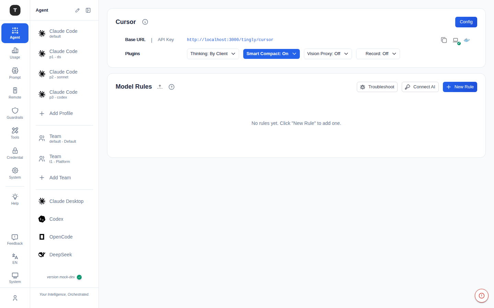
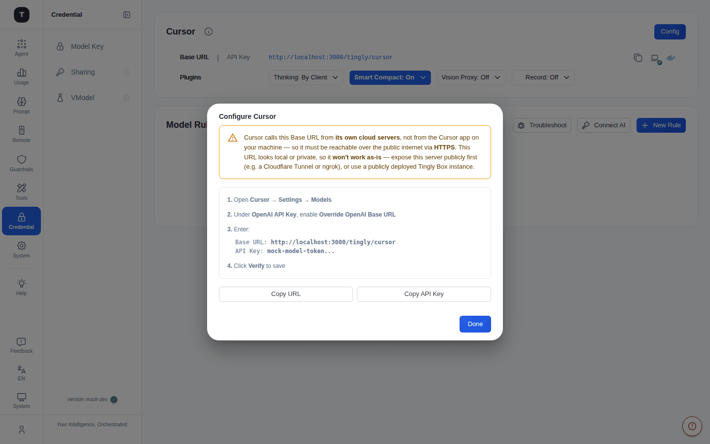

# Cursor 场景

路径：`/agent/cursor`

Cursor 默认在侧边栏中隐藏（如需使用，可在 [场景总览](./02-scenario-overview.md) 中取消隐藏）。该场景将 Cursor 的 OpenAI 兼容 API 请求代理到你配置的 Provider，其内置规则默认开启 **Cursor 兼容处理**（`cursor_compat`）。

---

## 为什么 Cursor 需要独立页面

与其他编程 Agent 场景不同，Cursor 是从 **Cursor 自己的云端后端**（`api2.cursor.sh`）调用你配置的 "Override OpenAI Base URL"，而**不是**从你本机运行的 Cursor 客户端调用。这意味着：

- `localhost` 或内网地址（`10.x`、`192.168.x`、`172.16–31.x`）**无法使用**——Cursor 的云端服务器访问不到
- Base URL 必须是**公网可达的 HTTPS** 地址——需先用 Cloudflare Tunnel、ngrok 或公网部署将本服务暴露出去

## 页面结构

### 1. Provider 配置卡

与 Claude Code 配置卡布局相同：
- **Base URL** / **API Key**（含复制按钮）
- **Plugins** 行：Thinking / Smart Compact / Vision Proxy / Record——详见 [Claude Code · Plugin 插件开关](./03-scenario-claude-code.md#plugin-插件开关)

右上角的 **Config** 按钮打开 **Configure Cursor** 弹窗，而不是常见的 Quick Start 引导步骤 / Auto Config 向导——因为 Cursor 没有本地配置文件可供 Tingly-Box 写入，配置只能手动复制粘贴到 Cursor 自己的设置界面中。

### 2. Configure Cursor 弹窗

- 顶部提示框会根据当前 Base URL 是否像是 Cursor 云端可达（本地/内网或非 HTTPS 时显示警告，否则显示提示）重申公网可达性要求
- 分步说明：打开 **Cursor → Settings → Models**，在 **OpenAI API Key** 下启用 **Override OpenAI Base URL**，填入下方显示的 Base URL 与 API Key，最后在 Cursor 中点击 **Verify** 保存
- **Copy URL** / **Copy API Key** 按钮

### 3. Model Rules（可折叠）

与 Claude Code 相同的路由图 UI——**Test All** / **Troubleshoot** / **Connect AI** / **New Rule** 工具栏；详见 [Claude Code · Model Rules](./03-scenario-claude-code.md#5-model-rules)。

---

## `cursor_compat` 标记

Cursor 的内置规则默认开启 `cursor_compat` 标记，用于规范富文本内容、限制工具定义、并剥离流式响应中的 usage 字段，以适配 Cursor 客户端的特殊行为。另有一个默认关闭的 `cursor_compat_auto` 标记，可以通过请求头自动识别 Cursor 流量，从而对其他客户端共用的规则也应用同样的处理——详见 [路由规则与插件 · App](./20-routing-rules.md#app)。

---

## 配置流程

1. 确保本 Tingly-Box 实例已通过 HTTPS 公网可达（隧道或公网部署）
2. 在 [凭证管理](./08-credentials.md) 添加至少一个 Provider
3. 如有需要，在 [场景总览](./02-scenario-overview.md) 取消隐藏 Cursor，然后打开 `/agent/cursor`
4. 点击 **Config**，按弹窗步骤在 Cursor 的 Settings → Models 面板中操作
5. 在 Cursor 中点击 **Verify** 确认连接成功

---

## 相关页面

- [场景总览](./02-scenario-overview.md)
- [Claude Code 场景](./03-scenario-claude-code.md)
- [路由规则与插件](./20-routing-rules.md)
- [凭证管理](./08-credentials.md)
