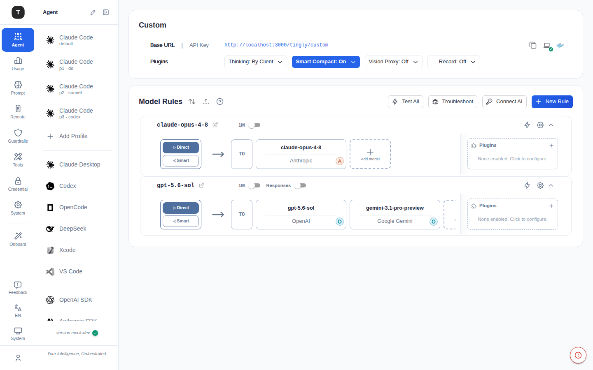
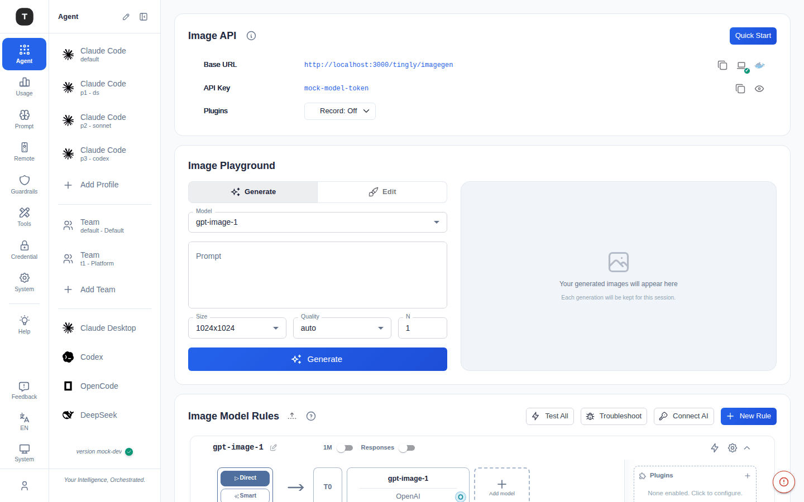
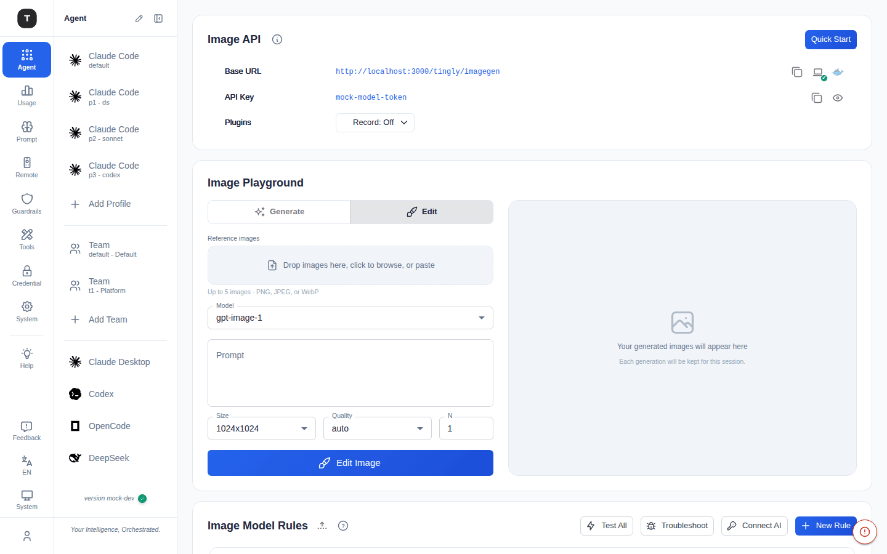
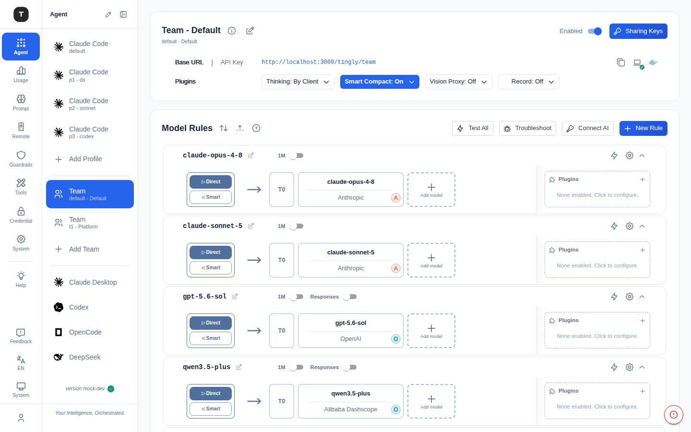

# Custom / Embed / Image Playground / Team

本章介绍四个专用场景：Custom 通用兜底场景（原「OpenClaw」）、Embedding API 代理、Image Playground（图像生成与编辑）以及多团队工作区。

---

## Custom

路径：`/agent/custom`



Custom 场景（侧边栏曾用名「OpenClaw」/「Claw Agent」）是一个通用兜底场景：可自定义请求模型名，为任意自定义 Agent 框架提供标准化的 API 端点。默认在侧边栏中隐藏（如需使用可在 [场景总览](./02-scenario-overview.md) 中取消隐藏）。

### 页面结构

1. **Provider 配置卡**：
   - **Base URL**：Agent 接口地址（含复制按钮）
   - **API Key**：访问凭证（含复制按钮）
2. **Model Rules**（可折叠）：配置 Agent 请求的路由规则

### 使用场景

- 自定义 Agent 框架需要统一的 API 端点
- 多个 Agent 需要共享同一组 Provider 凭证
- 需要为 Agent 访问配置独立的路由规则

---

## Embed（Embedding API）

路径：`/agent/embed`

代理 Embedding API 请求，适用于文本向量化应用。

### 页面结构

1. **Embed API 配置卡**：展示代理地址和 Key
2. **Embedding 模型与转发规则**（可折叠）：专门针对 Embedding 模型配置路由

### 使用场景

- RAG（检索增强生成）应用的文本向量化
- 语义搜索系统
- 文本相似度计算

### 接入方式

```python
from openai import OpenAI
client = OpenAI(
    base_url="<tingly-box-embed-url>",
    api_key="<tingly-box-api-key>",
)
response = client.embeddings.create(
    model="text-embedding-3-small",
    input="your text here",
)
```

---

## Image Playground（图像 Playground）

路径：`/agent/image`（旧的 `/agent/imagegen` 与旧的独立 `/agent/playground` 页面现在都会重定向到这里——图像生成配置与交互测试台合并到了同一个页面）



代理图像生成/编辑 API 请求（DALL-E 兼容接口），并内置一个交互式测试台，无需写代码即可试用 Prompt。

### 页面结构

1. **Image API 配置卡**：展示代理地址和 Key，另有一个 **Quick Start** 按钮（curl 示例，一键复制）
2. **Image Playground 卡**：交互测试台，详见下文
3. **Image Model Rules**（可折叠）：图像生成模型的路由规则

### Image Playground 卡

**Generate / Edit** 切换按钮在两种模式间切换：

**Generate（生成）模式**
- **Model** 下拉框（从已配置的 Image Model Rules 中读取）、**Prompt** 文本框、**Size** / **Quality** / **N**（数量）控件
- **Generate** 按钮；生成进行中会显示 **Generate another · N running** 按钮，可在不等待的情况下继续排队新任务

**Edit（编辑）模式**



- **Reference images** 拖放区——支持拖拽、点击浏览，或直接**粘贴**图片（最多 5 张，PNG/JPEG/WebP）
- 与生成模式相同的 Model/Prompt/Size/Quality/N 控件，按钮变为 **Edit Image**
- 每张结果缩略图都有 **Edit this image** 操作，可将其重新作为参考图输入——无需离开页面即可连续编辑

**结果面板**（右侧）
- 生成的图片显示在本次会话的画廊中（刷新页面后不保留）
- 每个结果都带有：**View original image**（查看原图，编辑结果可与源图对比）、**Copy prompt**、**Download**
- **Split into tiles**（切分为方格）：将结果切成均匀的行×列网格（外边距、间隙均可调），用于制作贴纸表、联系表或精灵图（spritesheet）。点击某格可将其排除，随后可 **Download this tile** 或 **Download N PNGs (ZIP)**

### 接入方式

```bash
curl <tingly-box-imagegen-url>/images/generations \
  -H "Authorization: Bearer <api-key>" \
  -H "Content-Type: application/json" \
  -d '{"model": "dall-e-3", "prompt": "a cute cat", "n": 1, "size": "1024x1024"}'
```

---

## Team（团队）

路径：`/agent/team`（默认团队）或 `/agent/team/:slug`（其他团队）。默认在侧边栏中隐藏。



多团队工作区让每个团队拥有各自独立的路由配置与共享密钥，使同一个 Tingly-Box 实例可以服务多个团队，而不会导致各团队的模型规则或 API Key 互相泄露。

### 工作区导航

团队在侧边栏中拥有独立的 **Profile 式**导航区块，与 Claude Code 的 Profile 机制类似：
- 每个团队是一个独立的导航项，副标题为 `slug - 名称`；内置的 **Default** 团队始终排在最前
- 区块底部的 **Add Team** 打开一个内联弹层，用于命名并创建新团队

### 页面结构

与其他场景页面结构相同：
1. **Provider 配置卡**，标题为 `Team - <名称>`：
   - 信息图标显示共享密钥的访问范围提示（密钥仅对 `/tingly/team` 和 `/tingly/team/v1` 生效——无法访问其他团队、场景端点或管理 API）
   - 编辑图标打开 **Team settings** 重命名团队；删除图标（仅非默认团队）用于删除团队——需先转移或删除其名下的共享密钥
   - **Enabled** 开关（右上角）：关闭后该团队的共享密钥将无法访问模型端点，但不会删除团队本身及其配置
   - **Sharing Keys** 按钮打开该团队的密钥管理弹窗
   - 与其他场景相同的 **Plugins** 行（Thinking / Smart Compact / Vision Proxy / Record）
2. **Model Rules**（可折叠）：该团队专属的路由规则，与其他团队相互独立

### Sharing Keys 弹窗

管理访问该团队 `/tingly/team` 端点的 API 令牌：
- **Create Token**：为新的共享密钥命名
- 表格列：名称、密钥（显示/复制）、启用开关、最后使用时间，以及 **Move**——将某个密钥转移到另一个启用中的团队，**且不轮换密钥本身**
- 删除密钥立即生效且不可撤销

---

## 相关页面

- [场景总览](./02-scenario-overview.md)
- [凭证管理](./08-credentials.md)
- [用量看板](./11-dashboard.md)
