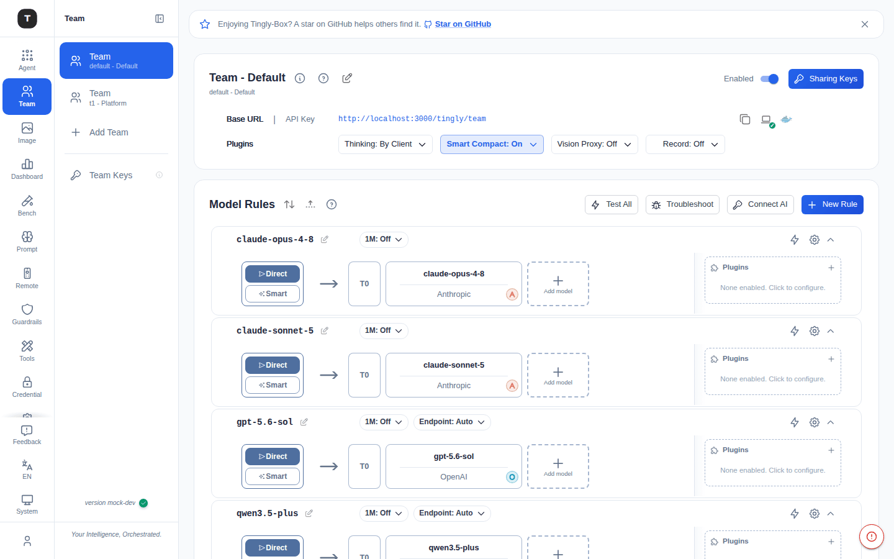
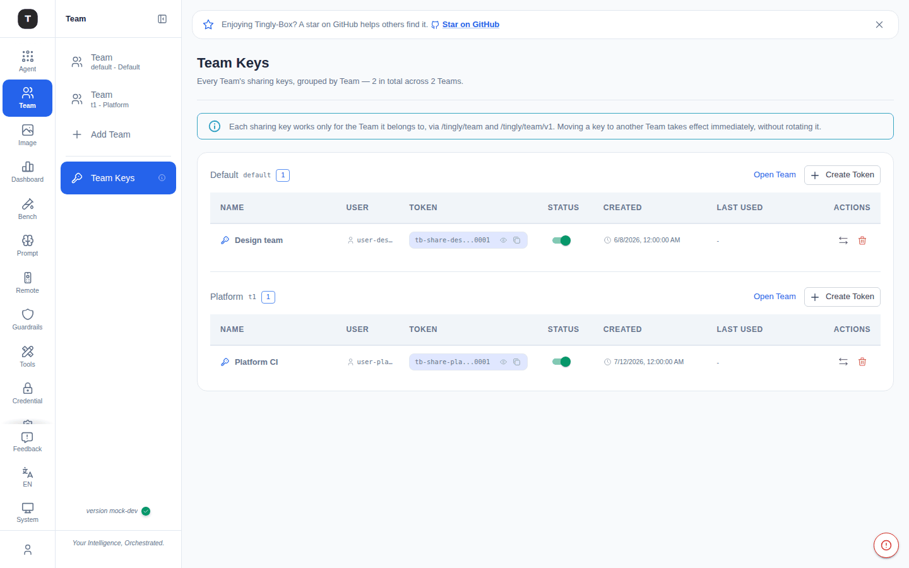

# Team（团队）

路径：`/agent/team`（默认团队）或 `/agent/team/:slug`（其他团队）；`/agent/team/keys`（Team Keys 总览）

**Team** 现在是左侧 Activity Bar 中独立的一级入口——不再是挂在 Agent 下的场景。它已从 Agent 侧边栏中拆出，拥有自己的导航图标、自己的工作区页面，以及一个专门的 Sharing Keys 管理页面。它默认在侧边栏中可见（[场景总览](./02-scenario-overview.md) 上的眼睛图标仍可控制其显隐，因为可见性依旧由同一个 `team` 场景 id 驱动）。

---

## Team 是什么

多团队工作区让每个团队拥有各自独立的路由配置与 Sharing Keys，使同一个 Tingly-Box 实例可以服务多个团队——客户、子团队、外部应用——而不会导致各团队的模型规则或 API Key 互相泄露。

- 一个 **Sharing Key** 只属于一个 Team，且只能访问 `/tingly/team` 和 `/tingly/team/v1`——无法访问其他 Team、其他场景端点（Claude Code、Codex……）或管理 API。
- 实例级的 **Global Model Token** 是另一类不受 Team 范围限制的独立凭证，仍保留跨场景的完整访问权限，不受 Team 边界影响。
- 转移、停用或删除某个密钥或 Team 会立即生效。

---

## 工作区导航

团队在侧边栏中拥有独立的 **Profile 式**导航区块，与 Claude Code 的 Profile 机制类似：

- 每个团队是一个独立的导航项，副标题为 `slug - 名称`；内置的 **Default** 团队（固定 ID，slug 为 `default`）始终排在最前。
- 区块底部的 **Add Team** 打开一个内联弹层，用于命名并创建新团队——系统会自动分配编号（`t1`、`t2`……；已删除团队的编号可以被复用，但底层 Team ID 永不复用，因此旧的规则/密钥/审计记录不会被误关联到复用了该编号的新团队）。
- 区块底部有一条分隔线，再往下是 **Team Keys**——跨所有 Team 的 Sharing Keys 总览，排在导航区块最后，因为它汇总了上面整个列表。

---

## Team 工作区页面

与其他场景页面结构相同：

1. **Provider 配置卡**，标题为 `Team - <名称>`：
   - **信息**图标显示 Sharing Key 的访问范围提示（密钥仅对 `/tingly/team` 和 `/tingly/team/v1` 生效——无法访问其他团队、场景端点或管理 API）
   - **How Team works**（帮助）图标打开 Team 引导弹窗（见下文）
   - **编辑**图标打开 **Team settings** 重命名团队；**删除**图标（仅非默认团队）用于删除团队——需先转移或删除其名下的 Sharing Keys
   - **Enabled** 开关（右上角）：关闭后该团队的 Sharing Keys 将无法访问模型端点，但不会删除团队本身及其配置
   - **Sharing Keys** 按钮打开该团队的密钥管理弹窗
   - 与其他场景相同的 **Plugins** 行（Thinking / Smart Compact / Vision Proxy / Record）
2. **Model Rules**（可折叠）：该团队专属的路由规则，与其他团队相互独立

---

## Team 引导弹窗

从工作区页面标题的帮助图标打开的 4 步引导——带步骤条、上一步/下一步按钮和语言切换：

1. **What a Team is for**（Team 的用途）——实例中一个隔离的切片（拥有自己的规则、Sharing Keys 与用量），用于在不共享主配置的前提下给某个群体开放模型访问
2. **How it's separated**（如何隔离）——一个 Sharing Key 只属于一个 Team，只能访问 `/tingly/team[/v1]`；你的 Global Model Token 不受 Team 范围限制，保留完整访问权限
3. **Configure a Sharing Key**（配置密钥）——如何通过 Sharing Keys 按钮创建密钥，以及如何在不轮换密钥的情况下将其转移到其他团队
4. **How it's used**（如何使用）——将客户端指向该 Team 的 Base URL，并用其 Sharing Key 作为 API Key；只有加入该 Team 规则的模型才可访问

---

## Sharing Keys

两个入口管理着同一批底层令牌：

- **Sharing Keys 弹窗**，从某个 Team 的工作区页面打开——仅显示该 Team 名下的密钥
- **Team Keys 页面**（`/agent/team/keys`，Team 导航区块下的独立入口）——实例上所有 Team 的全部 Sharing Keys，按 Team 分组显示（包括还没有密钥的空 Team，便于为其创建第一个密钥），方便在不逐个打开工作区的情况下扫描或转移密钥

两者渲染的是同一张表：

| 列 | 说明 |
|--------|-------------|
| Name | 创建时填写的显示名称 |
| User | 创建者的用户 id（截断显示） |
| Token | 掩码后的值，支持显示/隐藏与复制 |
| Status | 启用/禁用开关 |
| Created | 创建时间 |
| Last Used | 最后使用时间，或短横线 |
| Actions | **Move**（转移到另一个**已启用**的团队，且不轮换密钥）与 **Delete**（立即生效，不可撤销） |

- **Create Token** 按团队提供；对已禁用的团队，按钮仍然可见但处于禁用状态——原因在 hover 时提示——这样失败会在打开弹窗之前就被看到，而不是填完表单之后。
- 在 Team Keys 页面，每个 Team 分组的标题行显示团队名称、slug、密钥数量徽标、团队被禁用时的 **Inactive** 徽标、跳转到其工作区的 **Open Team** 按钮，以及该团队自己的 **Create Token** 按钮。

---

## 相关页面

- [场景总览](./02-scenario-overview.md)
- [Custom / Embed](./06-scenario-special.md)
- [用量看板](./11-dashboard.md)
