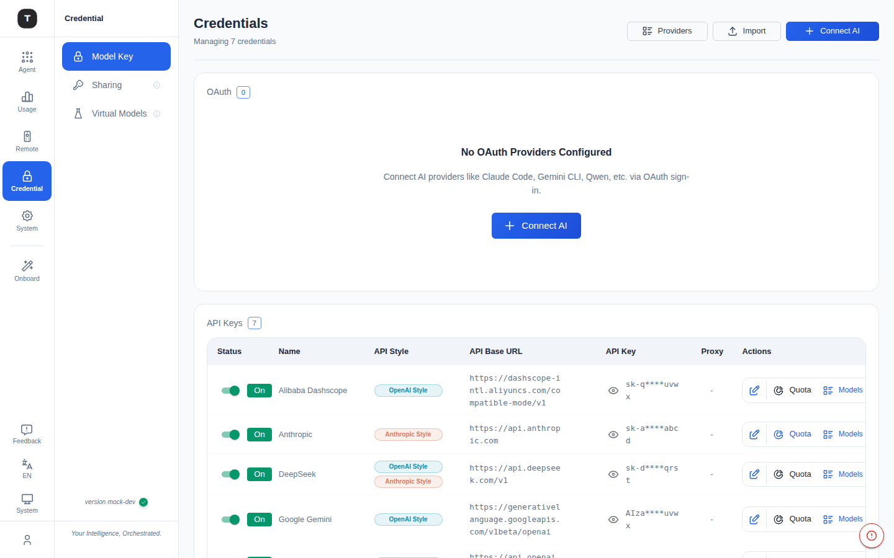
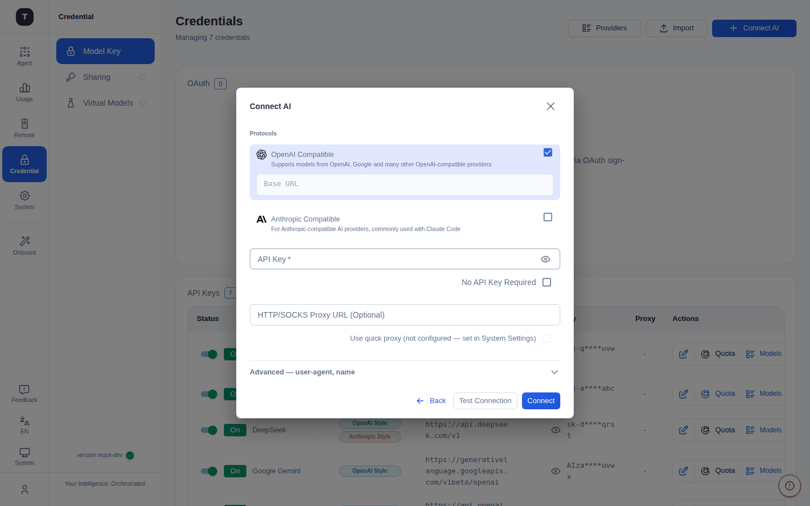

# 凭证管理

路径：`/credentials`

凭证管理页面是 Tingly-Box 的配置主链路核心，所有 Provider 的 API Key 和 OAuth 凭证均在此集中管理。

---



## 页面概览

侧边栏中该页面所在分组标签为 **Credential**，下含三个子页面：**Model Key**（本页）、**Sharing**（见 [API Tokens](./10-api-tokens.md)）、**Virtual Models**。

页面顶部显示当前凭证总数（如 `Managing 5 credentials`），顶部操作栏包含：

| 按钮 | 功能 |
|------|------|
| **Connect AI** | 打开统一 Provider 选择器，添加新凭证（与 Onboarding 流程相同） |
| **Import** | 批量导入 Provider 配置（JSON/YAML 格式） |
| **Providers** | 跳转到 Onboarding 页面（浏览全部 Provider） |

---

## 凭证类型

### API Keys 表格

展示所有通过 API Key 方式接入的 Provider：

| 列 | 说明 |
|----|------|
| Provider | Provider 名称与图标 |
| Base URL | API 端点地址 |
| Token | API Key（脱敏显示） |
| Status | 启用/禁用状态 |
| Quota | 已知配额信息（可点击刷新） |
| Actions | 编辑、删除、启用/禁用 |

### OAuth 表格

展示所有通过 OAuth 授权接入的 Provider（如 Claude.ai）：

| 列 | 说明 |
|----|------|
| Provider | Provider 名称 |
| Status | 授权状态 |
| Expiry | Token 过期时间 |
| Actions | 刷新 Token、编辑、删除、启用/禁用 |

---

## 添加 Provider（Connect AI 流程）

点击 **Connect AI** 打开 Provider 选择器。这是接入任何 AI 服务的统一入口，分两步完成：**先选类型，再填配置**。

### 第一步：选择 Provider


顶部是搜索框（按名称过滤），下方按接入方式分区展示，每张卡片右上角有彩色标签标明类型：

| 分区 | 说明 | 选中后 |
|------|------|--------|
| **Custom** | `Custom endpoint`（自带任意 Base URL）、`Import`（从文件/剪贴板导入） | 打开空白配置表单 / 导入对话框 |
| **OAuth sign-in** | 支持 OAuth 授权的 Provider（Claude Code、Google Gemini CLI、Codex 等） | **直接发起 OAuth 授权**，无需填 API Key |
| **Self-hosted** | 本地自托管服务（如 Ollama），卡片显示 `localhost:端口` | 打开配置表单，Base URL 已预填但**可编辑**（按你的主机/端口调整） |
| **API key providers** | 通过 API Key 接入的云端 Provider，按区域分组（CN / Global），卡片标注协议（OpenAI · Anthropic） | 打开配置表单，名称和 Base URL 已预填 |

> 大多数 Provider 都已内置，只需提供它们各自需要的信息。列表里没有？选 **Custom endpoint** 手动填任意端点。

### 第二步：填写配置表单



选中非 OAuth 的 Provider 后弹出配置表单：

- **Base URL**（必填）：API 端点。预置 Provider 已预填；Custom / Self-hosted 可自由编辑
- **API Key**（必填）：访问令牌；若是本地无鉴权服务，打开 **No API Key Required** 开关即可免填
- **API Style（协议）**：
  - **OpenAI Compatible**（推荐）：大多数端点都兼容 OpenAI 协议，不确定时选它
  - **Anthropic**：原生 Anthropic 协议
  - 两者可同时启用（融合 Provider），让同一凭证同时服务 OpenAI 和 Anthropic 两种入站协议
- **Proxy URL**（可选，展开高级）：为该 Provider 单独走 HTTP 代理
- **User Agent**（可选，展开高级）：自定义请求头

填好后可点 **Test** 验证连通性，再 **Save** 保存。

> **OAuth Provider 例外**：在第一步选中 OAuth 卡片后直接跳转授权页，无需第二步表单，授权完成自动保存 Token。

---

## 批量导入

点击 **Import** 按钮：

1. 选择文件（JSON 或 YAML 格式）或直接粘贴配置内容
2. 支持的格式示例：
   ```yaml
   providers:
     - name: "My OpenAI"
       api_base: "https://api.openai.com/v1"
       api_style: "openai"
       token: "sk-..."
   ```
3. 点击 **Import** 确认导入
4. 如有重复 Provider，系统提示是否强制覆盖（Force Add）

---

## 编辑 Provider

点击 Provider 行右侧的编辑图标，打开编辑表单，可修改：
- 名称
- API Base URL
- API Key/Token
- 代理设置
- 启用/禁用状态

---

## 启用 / 禁用 Provider

每个 Provider 行都有一个开关，用于快速启用或禁用。禁用的 Provider 不会接受新的路由请求，但配置保留。

---

## 相关页面

- [虚拟模型](./09-virtual-models.md)
- [API Tokens](./10-api-tokens.md)
- [快速上手](./01-getting-started.md)
