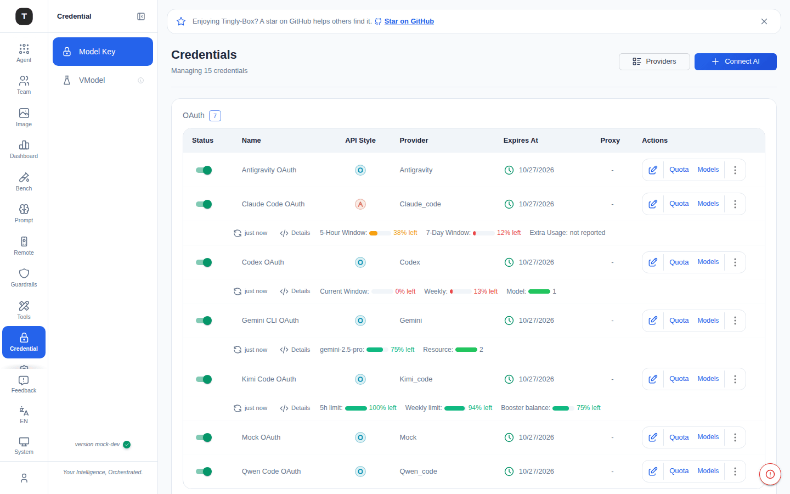
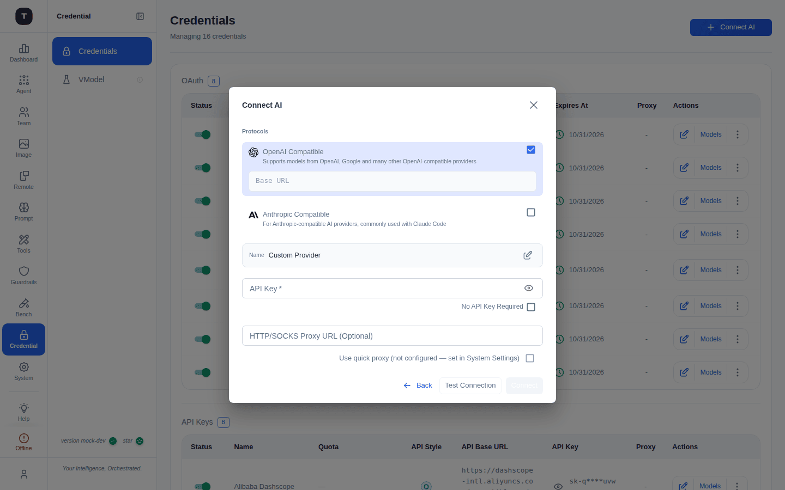

# 凭证管理

路径：`/credentials`

凭证管理页面是 Tingly-Box 的配置主链路核心，所有 Provider 的 API Key 和 OAuth 凭证均在此集中管理。

---

## 页面概览

侧边栏中该页面所在分组标签为 **Credentials**（不再是「Credential」/「Model Key」），下含两个子页面：**Credentials**（本页）、**VModel**（Virtual Models 的缩写，见 [虚拟模型](./09-virtual-models.md)）。旧的 **Sharing** 子页面已不存在——具名、可多个的外部客户端访问令牌现在是 Team 概念下的 **Sharing Keys**，改由 [Team](./07-team.md) 管理。

页面标题下的副标题显示当前凭证总数（`Managing N credentials`；为空时显示 `No credentials yet`）。页面头部只有一个操作：

| 按钮 | 功能 |
|------|------|
| **Connect AI** | 打开统一 Provider 选择器，添加新凭证（与 Onboarding 流程相同）——浏览 Provider 目录和填写配置的唯一入口 |

> 已不再有独立的 **Providers** 按钮（原本用于跳转到一个独立的目录页面）——Provider 目录现在从 Connect AI 的选择器内部进入。凭证配置也已不再提供页面级的批量导入/导出——请通过 Connect AI 逐个接入 Provider。（Guardrails 的 Secrets 页面仍保留独立的「Import from Credentials」快捷方式，详见 [防护栏](./15-guardrails.md)。）

---

## 凭证类型

只有实际存在的凭证类型才会渲染对应分区——某类型为空（如尚无 OAuth Provider）时不会再单独渲染一个空表格区块和一个多余的 Connect AI 按钮。当两种凭证都不存在时，整张卡片会折叠为单一的 **「Connect your first AI」** 空状态落地页（见下文），而不是展示两张空表格。

### OAuth 表格

展示所有通过 OAuth 授权接入的 Provider（如 Claude Code、Codex、Gemini CLI）：

| 列 | 说明 |
|----|------|
| Status | 启用/禁用开关 |
| Name | Provider 显示名称 |
| **Quota** | 实时用量，现为表格列（见下文），不再是行下方的详情区块 |
| API Style | 协议标签（OpenAI / Anthropic） |
| Provider | 底层 Provider 标识 |
| Expires At | Token 过期日期 |
| Proxy | 该凭证单独设置的代理（如有） |
| Actions | 编辑、Models、更多（⋮）——原来的 Quota 刷新/详情操作已移入 Quota 列（见下文） |

### API Keys 表格

展示所有通过 API Key 方式接入的 Provider：

| 列 | 说明 |
|----|------|
| Status | 启用/禁用开关 |
| Name | Provider 显示名称 |
| **Quota** | 实时用量，现为表格列（见下文） |
| API Style | 协议标签（OpenAI / Anthropic——融合 Provider 显示双标签） |
| API Base URL | 端点地址 |
| API Key | 脱敏显示，附眼睛图标可查看明文 |
| Proxy | 该凭证单独设置的代理（如有） |
| Actions | 编辑、Models、更多（⋮） |

### Quota 列

配额信息不再是行下方的独立色条，而是表格中专门的一列，单元格内最多三行紧凑文字（例如两个额度窗口如 `5h`/`7d`，外加一行金额），每行配一个显示剩余比例的小圆环。窗口**名称直接写在单元格里**（如 `5h  80% left`、`7d  42% left`），不再占用单独的标签列。金额以数额而非比例呈现：有上限的钱包显示 `$37.50 left` 并带圆环，无上限的支出显示 `$8.10 used` 不带圆环，单纯余额则只显示数字。

- 尚无读数 → 显示一个 `—`，但该单元格依然可点击以发起一次读取
- **悬停**该单元格可查看完整提示：每个窗口及其重置倒计时，提示框底部一行还提供 **Refresh**（刷新）与（当上游返回过原始响应时）**Details**（原始响应）。这两个操作原来是行内的独立图标，现在都收进了配额悬浮提示本身
- **点击**该单元格可立即刷新（效果同悬浮提示中的 Refresh）
- 超过 1 小时未更新的读数会变暗显示
- 没有配额 API 的 Provider 显示 `—`，或在提示中显示说明文字（如 `quota API not available — see the OpenAI dashboard`）

---

## 空状态

尚未配置任何凭证时，页面显示单一的落地区块（图标、「Connect your first AI」标题、一段关于「用已有订阅登录」或「粘贴 API Key」的简短说明，以及一个 **Connect AI** 按钮）——不再是每种凭证类型各自一个空区块。

---

## 添加 Provider（Connect AI 流程）

点击 **Connect AI** 打开 Provider 选择器。这是接入任何 AI 服务的统一入口，分两步完成：**先选类型，再填配置**。

### 第一步：选择 Provider

顶部是搜索框（按名称过滤），下方按接入方式分区展示，每张卡片右上角有彩色标签标明类型：

| 分区 | 说明 | 选中后 |
|------|------|--------|
| **Custom** | `Custom endpoint`（自带任意 Base URL）、`Import`（从文件/剪贴板导入）、`Paste & detect`（粘贴 `.env`、curl 命令或 JSON 片段，Tingly 自动提取 Provider 配置） | 打开空白配置表单 / 导入对话框 / 粘贴识别流程 |
| **OAuth sign-in** | 支持 OAuth 授权的 Provider（Claude Code、Google Gemini CLI、Codex 等） | **直接发起 OAuth 授权**，无需填 API Key。弹窗会预先展示固定的本地回调端口（如 Claude Code 使用 54545，Codex 使用 1455），并附带一个默认收起的 **"Running this remotely?"** 开关，展开后给出远程部署 Tingly-Box 时所需的 `ssh -L` 端口转发命令 |
| **Self-hosted** | 本地自托管服务（如 Ollama），卡片显示 `localhost:端口` | 打开配置表单，Base URL 已预填但**可编辑**（按你的主机/端口调整） |
| **API key providers** | 通过 API Key 接入的云端 Provider，按区域分组（CN / Global），卡片标注协议（OpenAI · Anthropic） | 打开配置表单，名称和 Base URL 已预填 |

> 大多数 Provider 都已内置，只需提供它们各自需要的信息。列表里没有？选 **Custom endpoint** 手动填任意端点。

> **Import 现在会展示导入结果**：导入不再是弹一个 Toast 就关闭，对话框会切换为一个结果列表，列出刚创建的每个 Provider——全部使用全新 UUID（不再有「按 UUID 匹配复用已有 Provider」的静默行为），若某个名称因冲突被自动加后缀，会附带「renamed」提示。每一行的 **Edit** 按钮会打开与其他地方相同的编辑对话框，改名或微调无需跳出当前流程。

### 第二步：填写配置表单

选中非 OAuth 的 Provider 后弹出配置表单：

- **Name（名称）**（必填）：现在始终显示在主表单中，不再收在 Advanced 折叠区里
- **Base URL**（必填）：API 端点。预置 Provider 已预填；Custom / Self-hosted 可自由编辑
- **API Key**（必填）：访问令牌；若是本地无鉴权服务，打开 **No API Key Required** 开关即可免填
- **API Style（协议）**：
  - **OpenAI Compatible**（推荐）：大多数端点都兼容 OpenAI 协议，不确定时选它
  - **Anthropic**：原生 Anthropic 协议
  - 两者可同时启用（融合 Provider），让同一凭证同时服务 OpenAI 和 Anthropic 两种入站协议
- **Advanced** 折叠区（默认收起）：目前只有 **Proxy URL**——为该 Provider 单独走 HTTP 代理。旧版的自定义 User-Agent 字段已移除。

**编辑模式**下弹窗标题变为「Edit AI Config」，标题栏关闭按钮旁新增一个 **Enabled** 开关——启用/禁用不再收在 Advanced 里。

填好后可点 **Test** 验证连通性，再 **Save** 保存。

> **OAuth Provider 例外**：在第一步选中 OAuth 卡片后直接跳转授权页，无需第二步表单，授权完成自动保存 Token。

---

## 编辑 Provider

点击 Provider 行右侧的编辑图标，打开编辑表单，可修改：
- 名称
- API Base URL
- API Key/Token
- 代理设置
- 启用/禁用状态

---

## 启用 / 禁用 Provider

每个 Provider 行都有一个开关，用于快速启用或禁用。禁用的 Provider 不会接受新的路由请求，但配置保留。

---

## 相关页面

- [虚拟模型](./09-virtual-models.md)
- [Team](./07-team.md)
- [快速上手](./01-getting-started.md)
