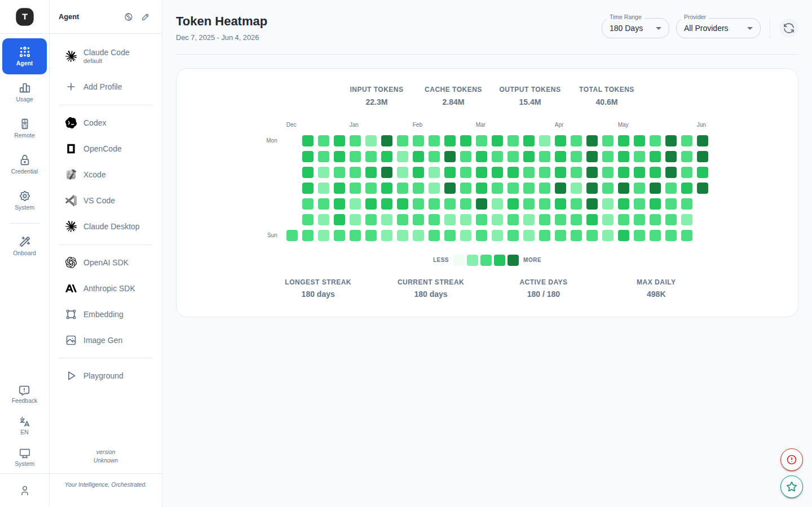

# 用量看板

路径：`/dashboard/:timeRange`（默认 `/dashboard/7d`）

用量看板提供 AI 请求的使用统计和可视化分析，帮助了解各 Provider 和模型的调用量、Token 消耗、缓存命中率等指标。

---

## 时间范围选择

页面顶部提供时间范围快速切换：

| 选项 | 路径 | 说明 |
|------|------|------|
| Today | `/dashboard/today` | 当日（按分钟粒度，每分钟自动刷新） |
| Yesterday | `/dashboard/yesterday` | 昨日（按分钟粒度） |
| 3D | `/dashboard/3d` | 近 3 天（按日展示） |
| 7D | `/dashboard/7d` | 近 7 天（按日展示，默认） |
| 30D | `/dashboard/30d` | 近 30 天（按日展示） |
| 90D | `/dashboard/90d` | 近 90 天（按日展示） |

---

## 统计卡片

页面顶部 5 个统计卡片汇总当前时间范围内的关键指标：

| 指标 | 说明 |
|------|------|
| **Total Requests** | 总请求次数 |
| **Total Tokens** | 总 Token 数（细分显示 Input / Cache / Output） |
| **Cache Hit Rate** | 缓存命中率（百分比）；绿色 ≥50%，黄色 ≥20%，橙色 &lt;20% |
| **Error Rate** | 请求失败率 |
| **Streamed Rate** | 流式响应比例 |

---

## 筛选器

顶部提供两个并排下拉菜单：

**Provider 筛选**：按认证类型分组展示所有可用 Provider（OAuth / API Key / Bearer Token / Basic Auth / Virtual Model）。选择后，图表和表格仅显示该 Provider 的数据。

**Model 筛选**：下拉列出当前时间范围内有数据的所有模型（按 Token 用量降序）。选择后仅展示该模型的数据。两个筛选器可组合使用；有活跃筛选时顶部显示 **Clear filters** 按钮。

---

## 自动刷新

顶部提供 **自动刷新** 开关（Auto-refresh）和手动 **刷新** 按钮，开启后数据每分钟自动更新。

---

## 图表区域

### 时序图（Token 历史）

- **今日/昨日**：按**分钟**粒度展示 Token 使用量（每分钟自动刷新，Input / Cache / Output 堆叠）
- **3D / 7D / 30D / 90D**：按天粒度展示每日 Token 使用量

### Summary / By Request 切换

今日/昨日视图下，图表区提供两种展示模式：
- **Summary**：分钟粒度时序图（HourlyTokenHistoryChart）
- **By Request**：单条请求明细列表（时间、模型、Token 数、响应时间等）

---

## 右侧：Top Models

显示当前时间范围内按 Token 消耗量排名的所有模型（带分页）：
- 模型名称 + 所属 Provider
- Token 消耗量（带进度条）
- 点击可快速**按该模型筛选**（而非 Provider）

---

## 底部：服务统计表格

按模型/Provider 细分展示详细统计数据：

| 列 | 说明 |
|----|------|
| Model | 模型名称 + Provider |
| Requests | 请求次数 |
| Input Tokens | 输入 Token 数 |
| Output Tokens | 输出 Token 数 |
| Cache Tokens | 缓存命中 Token 数 |
| Errors | 错误次数 |
| Cache Hit % | 缓存命中率 |
| Streamed % | 流式响应比例 |

---

## 今日/昨日视图补充

当选择 `Today` 或 `Yesterday` 时，图表切换为**按分钟**粒度，可实时看到 Token 用量曲线，每分钟自动刷新。右侧提供 **Summary / By Request** 切换：By Request 视图展示每条请求的详细记录。

---

## Token 热力图

路径：`/overview/:timeRange`（默认 `/overview/180d`）

在活动栏「Usage」分组底部，**Heatmap** 导航项提供日历热力图视图，完整呈现长期使用密度。

### 顶部汇总数据

| 指标 | 说明 |
|------|------|
| INPUT TOKENS | 时间范围内累计输入 Token |
| CACHE TOKENS | 时间范围内缓存命中 Token |
| OUTPUT TOKENS | 时间范围内累计输出 Token |
| TOTAL TOKENS | 总 Token（以上三项之和） |

### 热力图区域

- 横轴：月份（Dec / Jan / Feb …）
- 纵轴：周内星期（Mon–Sun）
- 色块深浅对应当日 Token 使用量（颜色越深 = 使用越多）

### 底部统计数据

| 指标 | 说明 |
|------|------|
| LONGEST STREAK | 历史最长连续活跃天数 |
| CURRENT STREAK | 当前连续活跃天数 |
| ACTIVE DAYS | 活跃天数 / 总天数 |
| MAX DAILY | 单日最高 Token 用量 |

### 筛选选项

- **Time Range**：180 Days / 365 Days
- **Provider**：All Providers 或指定 Provider

---

## 相关页面

- [系统设置](./17-system-settings.md)
- [凭证管理](./08-credentials.md)
