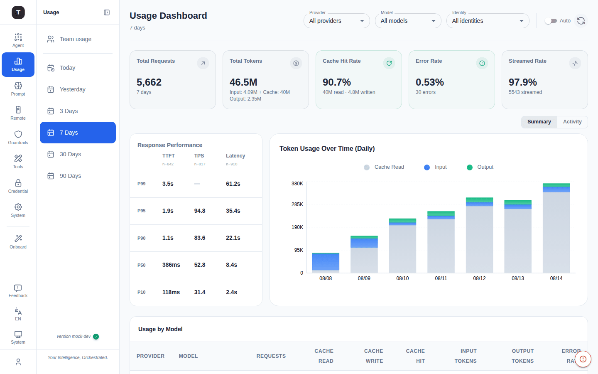
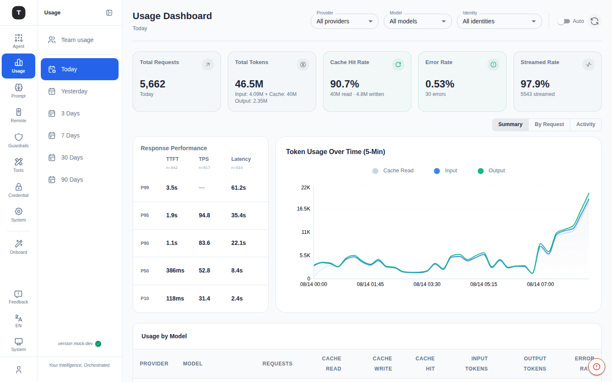
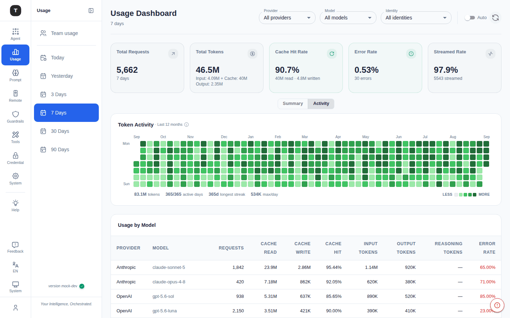
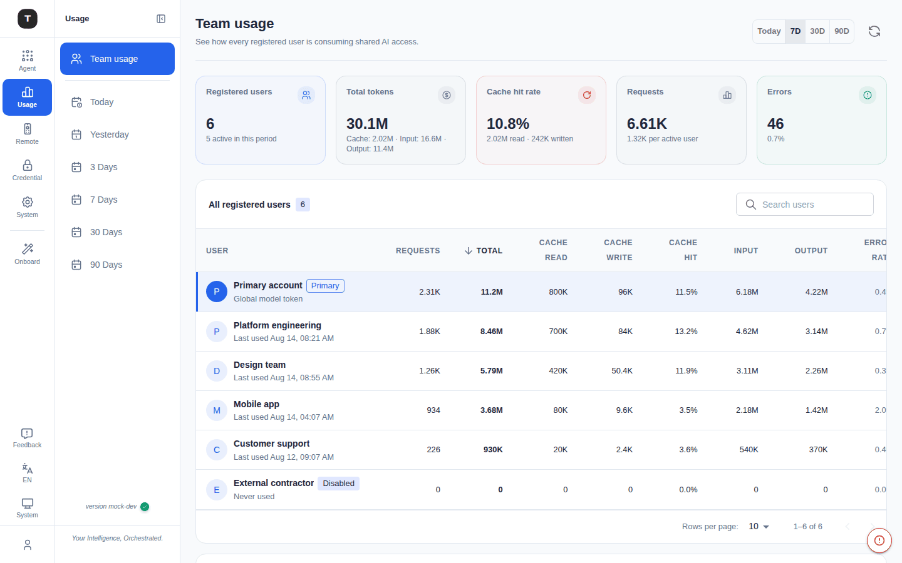

# 用量看板

路径：`/dashboard/:timeRange`（默认 `/dashboard/7d`）；同级页面 `/dashboard/users`（**Team usage**）

用量看板提供 AI 请求的使用统计和可视化分析，帮助了解各 Provider 和模型的调用量、Token 消耗、缓存命中率、响应性能等指标。

---

## 时间范围选择

页面顶部提供时间范围快速切换。侧边栏 **Usage** 分组下依次列出全部选项，**Team usage**（`/dashboard/users`）作为独立的一级入口显示在时间范围列表上方：

| 选项 | 路径 | 说明 |
|------|------|------|
| Today | `/dashboard/today` | 当日（按分钟粒度，每分钟自动刷新） |
| Yesterday | `/dashboard/yesterday` | 昨日（按分钟粒度） |
| 3D | `/dashboard/3d` | 近 3 天（按日展示） |
| 7D | `/dashboard/7d` | 近 7 天（按日展示，默认） |
| 30D | `/dashboard/30d` | 近 30 天（按日展示） |
| 90D | `/dashboard/90d` | 近 90 天（按日展示） |

---

## 统计卡片

页面顶部 5 个统计卡片汇总当前时间范围内的关键指标：

| 指标 | 说明 |
|------|------|
| **Total Requests** | 总请求次数 |
| **Total Tokens** | 总 Token 数（副标题：`Input: X + Cache: Y` / `Output: Z`） |
| **Cache Hit Rate** | 缓存命中率（百分比；绿色 ≥50%，黄色 ≥20%，橙色 &lt;20%）；副标题将缓存总量拆分为**读**与**写**（如 `40M read · 4.8M written`） |
| **Error Rate** | 请求失败率 |
| **Streamed Rate** | 流式响应比例 |

---

## 筛选器

顶部提供三个并排下拉菜单：

**Provider 筛选**：按认证类型分组展示所有可用 Provider（OAuth / API Key / Bearer Token / Basic Auth / Virtual Model）。选择后，图表和表格仅显示该 Provider 的数据。

**Model 筛选**：下拉列出当前时间范围内有数据的所有模型（按 Token 用量降序）。选择后仅展示该模型的数据。

**Identity 筛选**：按请求方身份（`user_id`）筛选（如有数据）。

三个筛选器可组合使用；有活跃筛选时顶部显示 **Clear filters** 按钮。

---

## 自动刷新

顶部提供 **自动刷新** 开关（Auto-refresh）和手动 **刷新** 按钮，开启后数据每分钟自动更新。

---

## 图表区域

### 时序图（Token 历史）

- **今日/昨日**：按**分钟**粒度展示 Token 使用量（每分钟自动刷新，Input / Cache / Output 堆叠）
- **3D / 7D / 30D / 90D**：按天粒度展示每日 Token 使用量

### Summary / By Request / Activity 切换

图表上方的分段按钮组用于切换展示模式：
- **Summary**：上述时序图（今日/昨日为分钟粒度折线，其余为按日柱状图）
- **By Request**：仅今日/昨日可见——单条请求明细列表（时间、模型、Token 数、响应时间等）
- **Activity**：GitHub 风格的贡献热力图，详见下文「活动热力图」一节

---

## 左侧：Response Performance（响应性能）

取代了旧版的「Models by Token Usage」面板。展示当前时间范围与筛选条件下的延迟/吞吐百分位表：

| 列 | 说明 |
|----|------|
| TTFT | 首字节延迟（Time to First Token） |
| TPS | 每秒 Token 数 |
| Latency | 请求总耗时 |

每行是一个百分位——**P99、P95、P90、P50、P10**，各自附带样本数（`n=…`）。显示为 `—` 表示该百分位在此指标上无数据（例如请求在产生任何流式 Token 前就报错，TPS 无法计算）。

---

## 底部：Usage by Model 表格

按模型/Provider 细分展示详细统计数据（带分页）：

| 列 | 说明 |
|----|------|
| Provider | Provider 名称 |
| Model | 模型名称（可点击链接） |
| Requests | 请求次数 |
| Cache Read | 缓存读取 Token 数 |
| Cache Write | 缓存写入 Token 数 |
| Cache Hit | 缓存命中率（%） |
| Input Tokens | 输入 Token 数 |
| Output Tokens | 输出 Token 数 |
| Error Rate | 请求失败率（%） |

---

## 今日/昨日视图补充

当选择 `Today` 或 `Yesterday` 时，图表切换为**按分钟**粒度，可实时看到 Token 用量曲线，每分钟自动刷新；同时 Summary/By Request/Activity 切换按钮组中会出现 **By Request** 选项，展示每条请求的详细记录。

---

## 活动热力图

点击图表区切换按钮组中的 **Activity**，即可在 Dashboard 内部切换为 GitHub 风格的贡献热力图——该视图原本是独立的 `/overview` 页面，现已合并为同一图表区的一种视图，并与看板的 Provider / Model / Identity 筛选器共享数据。

- **固定窗口**：始终展示**最近 365 天**，不受页面选定时间范围影响（7D/30D 等仅影响 Summary/By Request 视图）
- **网格**：横轴为月份，纵轴为周内星期（Mon–Sun）；色块深浅对应当日 Token 使用量（颜色越深 = 使用越多）
- **底部统计**：该窗口内的 Token 总量、活跃天数/总天数、最长连续活跃天数、单日最高用量
- 首次加载时显示骨架占位，避免在数据到达前闪现空状态

---

## Team Usage（`/dashboard/users`）

副标题：「See how every registered user is consuming shared AI access.」按**已注册用户**（而非模型/Provider）拆分看板用量——适用于多人通过同一个共享 Model Token 使用同一 Tingly-Box 实例的场景。

### 时间范围

独立的快速切换：**Today / 7D / 30D / 90D**，附手动刷新按钮。

### 统计卡片

| 指标 | 说明 |
|------|------|
| Registered users | 用户总数，副标题显示当前周期内活跃用户数 |
| Total tokens | 全部用户汇总；副标题拆分 Cache / Input / Output |
| Cache hit rate | 百分比；副标题显示缓存写入量 |
| Requests | 总请求数；副标题显示人均活跃用户请求数 |
| Errors | 错误次数与错误率 |

### 已注册用户列表

每行一个用户，支持按名称搜索：

| 列 | 说明 |
|----|------|
| User | 用户名；绑定全局 Model Token 的账户显示 **Primary** 徽章，被禁用的显示 **Disabled** 徽章；副标题显示最后使用时间（或 `Never used`） |
| Requests | 请求次数 |
| Total | Token 总量（可排序，默认排序列） |
| Cache Read / Cache Write / Cache Hit | 与主看板相同的缓存拆分数据，按用户统计 |
| Input / Output | Token 数量 |
| Error Rate | 该用户的失败率 |

---

## 相关页面

- [系统设置](./17-system-settings.md)
- [凭证管理](./08-credentials.md)
