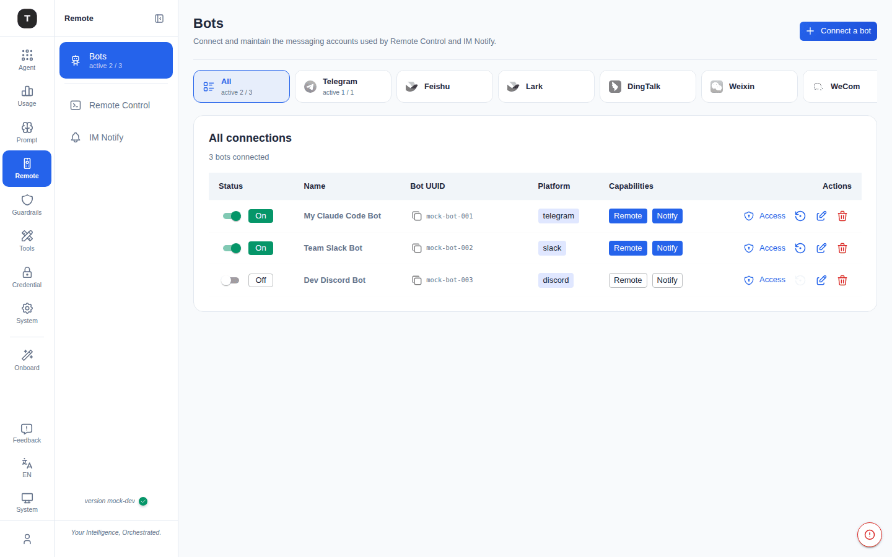
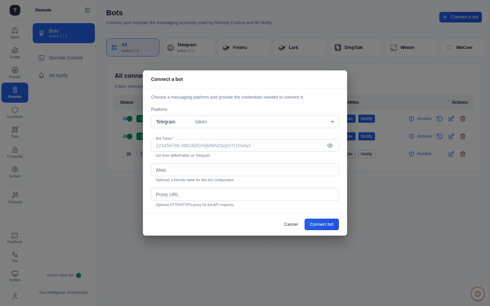
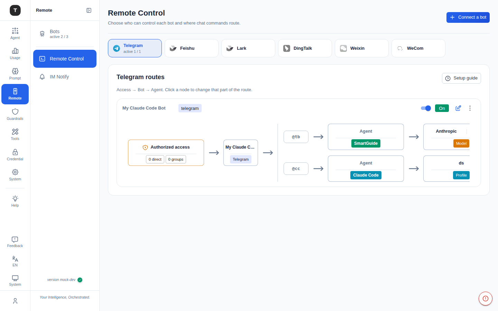
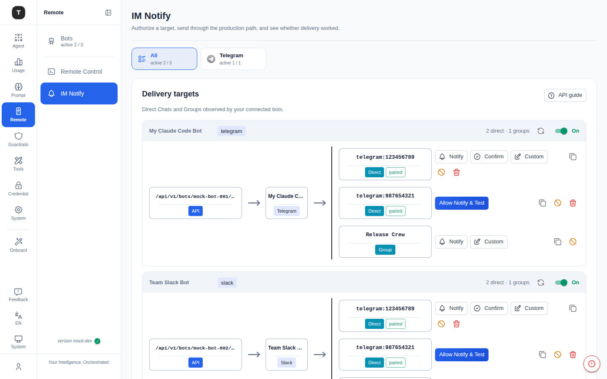

# Remote

路径：`/bots/*`、`/remote-agent/:platform`、`/notify`（完整版）

**Remote** 分组用于通过主流 IM 平台远程控制 Claude Code（及其他 Agent）。按关注点拆分为三个页面：**Bots**（接入消息账号）、**Remote Control**（将收到的聊天指令路由到某个 Agent）、**IM Notify**（将结果主动推送回聊天）。

> **注意**：Remote 功能仅在**完整版**中提供。

---

## Bots（`/bots/overview`、`/bots/:platform`）



资源层：接入并维护 Remote Control 与 IM Notify 共用的消息账号。页面副标题：「Connect and maintain the messaging accounts used by Remote Control and IM Notify.」

支持平台：Telegram、Feishu、Lark、DingTalk、Weixin（微信）、WeCom（企业微信）、QQ、Discord、Slack——通过平台标签行筛选（**All** 加每个平台一个标签，均显示 `active N / total N` 计数）。

### 连接列表

| 列 | 说明 |
|----|------|
| Status | 启用/禁用开关 + On/Off 徽章 |
| Name | Bot 别名 |
| Bot UUID | 唯一 Bot 标识（含复制按钮） |
| Platform | 平台标识（如 `telegram`） |
| Capabilities | **Remote** / **Notify** 徽章——该 Bot 参与另外两个页面中的哪些功能 |
| Actions | **Access**（会话 ID / 群组授权）、恢复、编辑、删除 |

### 接入 Bot

点击右上角 **Connect a bot**：



1. 从下拉菜单选择 **Platform**
2. 填写该平台所需凭证（如 Telegram 的 **Bot Token**，从 `@BotFather` 获取）
3. 可选：**Alias**（友好名称）、**Proxy URL**（Bot API 请求使用的 HTTP/HTTPS 代理）
4. 点击 **Connect bot**

每个平台标签下还提供可展开的 **Setup Guide**，包含该平台专属的接入步骤、凭证说明和示例。

> 微信（Weixin）Bot 使用**扫码登录**而非 Token——发起连接后对话框会显示二维码供扫描。

---

## Remote Control（`/remote-agent/:platform`）



路由层：「Choose who can control each bot and where chat commands route.」为每个 Bot 定义链路：**Access → Bot → Agent**。

- **Access**：授权节点——允许发起指令的直接会话 ID 和/或群组（无限制时显示 `0 direct`、`0 groups`）
- **Bot**：该路由对应哪个已接入的 Bot（来自 Bots 页面）
- **Agent**：Bot 指令路由到哪个场景，以及由哪个模型/Profile 处理

点击路由图中的任意节点即可编辑对应部分。右上角 **Setup guide** 按钮提供首次配置引导。

> 旧的 `/remote-control/*` 书签会自动重定向到这里。

---

## IM Notify（`/notify`）



出站通知层：「Authorize a target, send through the production path, and see whether delivery worked.」让场景和自动化流程能够向 Bot 已观察到的聊天/群组主动推送消息，与 Remote Control 的入站路由互不干扰。

### 投递目标

按 Bot 分组，每个目标行显示：
- 聊天/群组标识（如 `telegram:123456789`）及类型（**Direct** 私聊或 **Group** 群组）
- 配对状态（`paired`）
- 操作：**Notify**（发送测试/手动消息）、**Confirm**（未确认目标显示为 **Allow Notify & Test**）、**Custom**（自定义内容）、复制、撤销、删除

新目标必须先经过显式授权（**Allow Notify & Test**）才能接收自动化通知——避免 Bot 偶然观察到的任何聊天悄然变成通知目标。

右上角 **API guide** 按钮提供供脚本/自动化调用的通知 API 文档。

---

## Bot 安全设置

### 授权访问（Access）

在 Bots 页面点击某个 Bot 行的 **Access**，限制哪些会话 ID 或群组可以向其发送指令——与 Remote Control 路由图中 **Access** 节点编辑的是同一份授权配置。

### Bash 白名单

在每条 Bot→Agent 路由上配置：每行一个命令模式，限制 Bot 可触发的 Shell 命令。不在白名单中的命令将被拒绝。示例：

```
ls
cat *.md
git status
git diff
```

---

## 使用方式

Bot 接入（Bots）并路由到某个 Agent（Remote Control）后，即可在 IM 平台上向其发送消息：

- 发送代码请求 → Bot 调用路由到的 Agent（如 Claude Code）执行
- 查询状态 → Bot 返回当前运行状态
- 发送文件 → Bot 在工作目录中处理该文件

长任务完成、告警等出站更新通过 IM Notify 推送给已授权的目标。

---

## 相关页面

- [场景总览](./02-scenario-overview.md)
- [系统设置](./17-system-settings.md)
