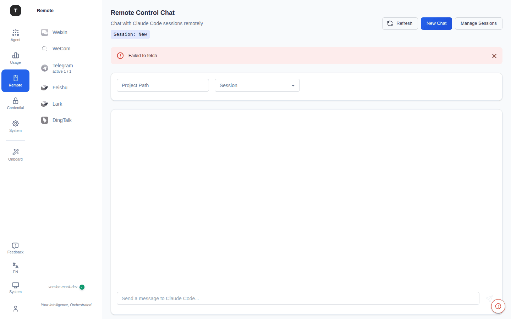
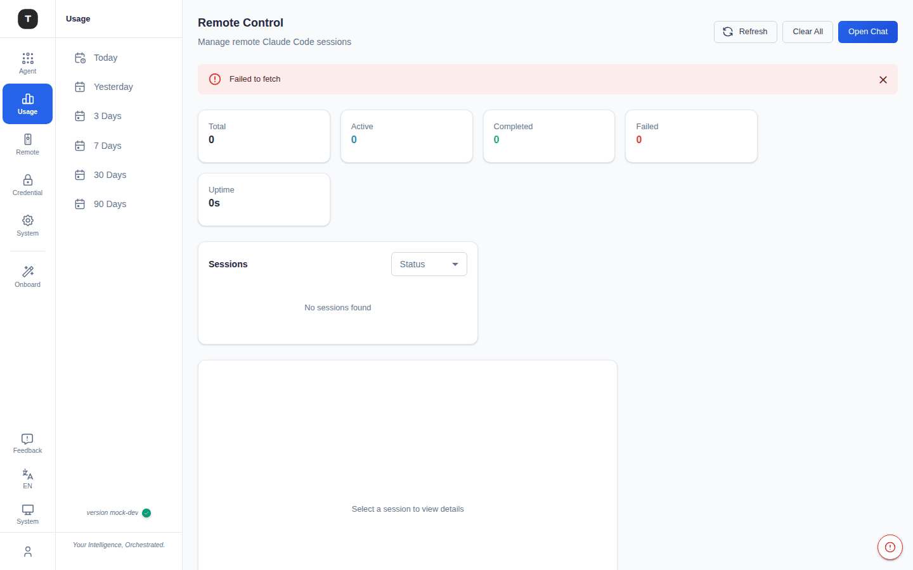

# Remote Coder

路径：`/remote-coder/chat`、`/remote-coder/sessions`

Remote Coder 提供基于 Web 的对话界面，直接在浏览器中与 Claude Code 会话交互，并提供会话管理和监控能力。

---

## Chat 页面（`/remote-coder/chat`）

### 页面结构

**顶部栏：**
- 当前会话 ID 显示
- **New Chat** 按钮：创建新会话
- **Manage Sessions** 按钮：跳转到会话管理页

**配置区：**
- **Session 选择器**：下拉菜单选择已有会话
- **Project Path 字段**：指定 Claude Code 的工作目录（首次发送消息前必填）

**对话区：**
- 聊天历史记录，自动滚动到最新消息
- 消息摘要显示，支持展开/折叠完整内容
- `Claude Code is thinking...` 加载状态指示
- 错误信息提示区

**输入区：**
- 多行文本输入框（`Shift+Enter` 换行，`Enter` 发送）

---

## 使用流程

1. 访问 `/remote-coder/chat`
2. 在 **Project Path** 中填写要操作的项目路径（如 `/home/user/my-project`）
3. 选择已有会话或发送第一条消息自动创建新会话
4. 在输入框中输入需求，如：`帮我分析这个项目的结构` 或 `修复第 42 行的 bug`
5. 等待 Claude Code 执行并返回结果

---

## Sessions 页面（`/remote-coder/sessions`）

### 页面结构

**统计卡片（顶部）：**

| 指标 | 说明 |
|------|------|
| Total | 总会话数 |
| Active | 运行中会话数 |
| Completed | 已完成会话数 |
| Failed | 失败会话数 |
| Closed | 已关闭会话数 |
| Uptime | 服务运行时长 |

**左侧面板（40%宽）：会话列表**

- 状态筛选：All / Running / Completed / Failed / Closed
- 搜索框：按会话 ID 或内容搜索
- 每条会话显示：ID、状态徽章、时间

**右侧面板（60%宽）：会话详情**

点击左侧会话后，右侧展示：
- 完整请求内容
- 响应摘要
- 错误信息（如有）
- 会话元数据

### 操作

- **Refresh** 按钮：手动刷新会话列表
- **Clear All Sessions** 按钮：清空全部会话记录（需确认）

---

## 与远程控制的区别

| | Remote Coder | 远程控制 |
|-|-------------|----------|
| 交互方式 | Web 浏览器 Chat | IM 平台消息 |
| 实时性 | 实时（Web Push） | 依赖平台推送延迟 |
| 会话管理 | 内置会话视图 | 无独立管理 |
| 适用场景 | 开发者直接操作 | 随时随地远程触发 |

---

## 相关页面

- [远程控制](./12-remote-control.md)
- [场景总览](./02-scenario-overview.md)
