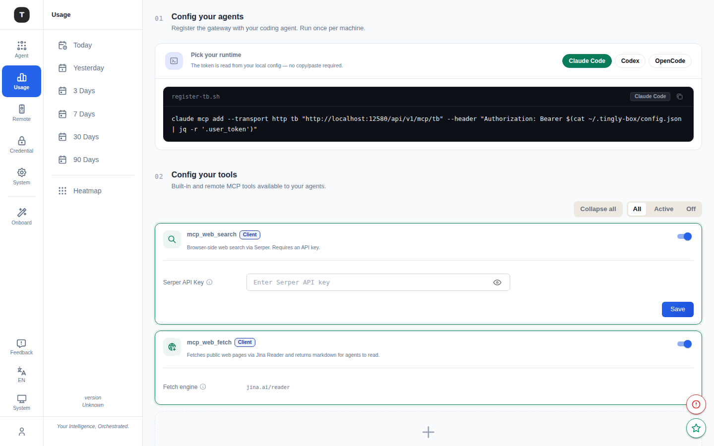
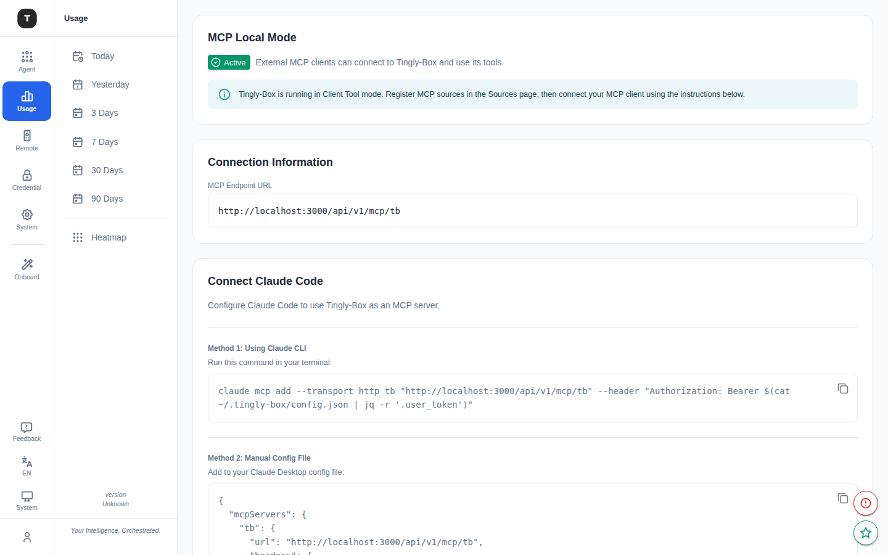

# MCP 与工具

路径：`/mcp/sources`、`/mcp/local-mode`、`/tools/servertool`

MCP（Model Context Protocol）工具扩展支持为 Claude Code 等场景注册外部工具服务器，包括内置 Web 工具和自定义 MCP 服务器。

> **注意**：MCP 功能需要在 [实验性功能](./19-experimental.md) 中开启 MCP Tools 开关后，侧边栏才会显示。

---



## MCP 注册服务器（`/mcp/sources`）

### 两步配置流程

**Step 1：安装 Agent**

页面顶部展示将 Tingly-Box 配置为 MCP 代理的 Agent 安装说明，包括 CLI 安装命令（一键复制）。

**Step 2：配置工具（Configure Tools）**

分为两部分：

#### 内置 Web 工具

| 工具 | 说明 |
|------|------|
| **mcp_web_search** | 网络搜索工具，需配置 Serper API Key |
| **mcp_web_fetch** | 网页内容抓取工具（基于 Jina Reader） |

每个工具提供独立开关（启用/禁用）和必要的配置字段（如 API Key 输入框）。

#### 自定义 MCP 服务器

**工具栏：**
- **Add Server**：添加新的自定义 MCP 服务器
- 状态筛选：All / Active / Disabled

**服务器列表：**

| 列 | 说明 |
|----|------|
| Server ID | 服务器唯一标识 |
| Connection | 连接信息（命令/URL） |
| Transport | 传输类型徽章：STDIO / HTTP / SSE |
| Visibility | Client（客户端侧） / Server（服务端侧） |
| Status | 启用/禁用开关 |
| Actions | 编辑、删除 |

**添加自定义服务器配置：**
- 服务器 ID
- 传输类型（STDIO / HTTP / SSE）
- 连接参数（命令或 URL）
- Visibility 设置

---

## MCP 本地模式（`/mcp/local-mode`）



配置 Claude Code 将 Tingly-Box 作为 MCP 服务器使用。

页面顶部显示当前状态：
- **Active**（绿色）：MCP 服务正在运行，外部客户端可以连接
- 提示信息：`Tingly-Box is running in Client Tool mode. Register MCP sources in the Sources page, then connect your MCP client using the instructions below.`

### Connection Information

展示 **MCP Endpoint URL**（完整地址，含认证信息），是 Claude Code 连接所需的端点。

### Connect Claude Code

**方法一：Claude CLI**

```bash
claude mcp add --transport http tb "<mcp-endpoint-url>" \
  --header "Authorization: Bearer $(cat ~/.tingly-box/config.json | jq -r '.user_token')"
```

命令会自动从 `~/.tingly-box/config.json` 中读取 User Token 作为 Bearer Token，无需手动输入。

**方法二：手动配置文件**

将以下片段添加到 Claude Desktop 配置文件（含认证 Header）：

```json
{
  "mcpServers": {
    "tb": {
      "url": "<mcp-endpoint-url>",
      "headers": { "Authorization": "Bearer <your-token>" }
    }
  }
}
```

页面标注了各操作系统下配置文件的默认路径。

---

## Server Tool（`/tools/servertool`）

路径：`/tools/servertool`

查看和测试 Tingly-Box 服务端当前可用的 MCP 工具列表。

---

## 相关页面

- [实验性功能](./19-experimental.md)
- [防护栏](./15-guardrails.md)
- [Claude Code 场景](./03-scenario-claude-code.md)
