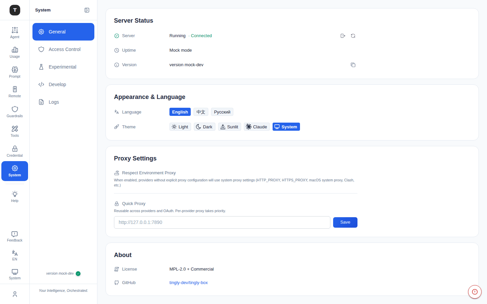
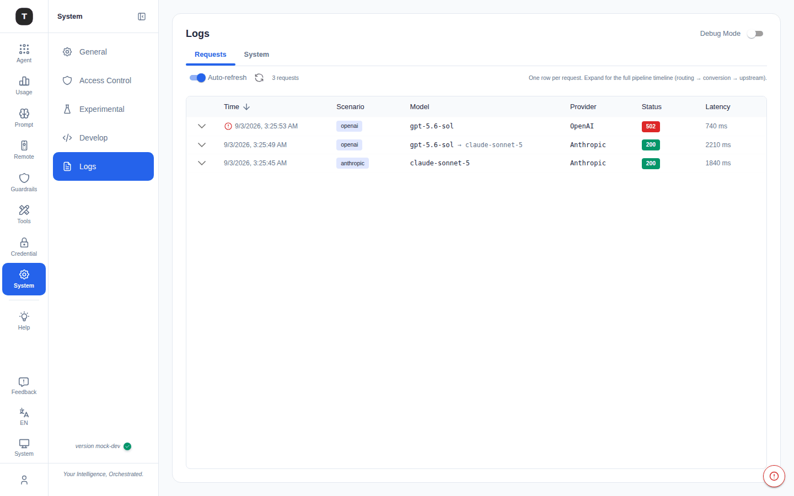

# 系统设置

路径：`/system`、`/system/logs`

系统设置页面提供全局偏好配置、服务器状态查看、代理设置、语言/主题切换和日志查看功能。

---

## 系统设置主页（`/system`）

General 标签页由四张卡片组成：

### 服务器状态卡（Server Status）

| 字段 | 说明 |
|------|------|
| Server | 运行中（Running）/ 已停止 / 不可用，附带 Connected/Disconnected 指示 |
| Uptime | 服务器已运行时长 |
| Version | 当前版本号，附复制按钮——从 About 卡移到此处 |

**操作**（右上角图标）：**Force Logout**（强制退出当前 Web 会话，清除 Token 并返回登录页）与 **Refresh Status**（手动刷新状态）。

有新版本可用时，点击版本提示会打开 **Update** 弹窗：一个渠道切换按钮组（`npx` / `npm` / `bundle` / `docker`）在不同安装方式间切换，每种方式都附带一键复制的命令——

| 渠道 | 命令 | 适用场景 |
|------|------|----------|
| `npx`（默认） | `npx tingly-box@<版本号>` | 快速更新——一条命令完成下载并重启 |
| `npm` | `npm install -g tingly-box@<版本号>` | 更新全局安装的 CLI；更新后需手动重启服务生效 |
| `bundle` | `npx -y tingly-box-bundle@<版本号>` | 内置二进制文件的离线安装包，适用于网络不稳定的场景 |
| `docker` | — | 从 GitHub Container Registry 拉取新镜像 |

---

### Appearance & Language 卡

- **Language**：`English` / `中文` / `Русский`。首次加载且尚未保存明确选择时，会回退到浏览器自身的语言设置。
- **Theme**：`Light` / `Dark` / `Sunlit` / `Claude` / `System`（跟随系统设置）

---

### Proxy Settings 卡

将两种代理控制合并到一张卡片中：

- **Respect Environment Proxy**：开启后，未单独设置代理的 Provider 会回退使用系统环境代理配置（`HTTP_PROXY`、`HTTPS_PROXY`、macOS 系统代理、Clash 等）
- **Quick Proxy**：可复用的 HTTP/HTTPS 代理预设，Provider 和 OAuth 一键即可采用——输入地址（如 `http://127.0.0.1:7890`）并点击 **Save**；若某 Provider 单独设置了代理，则以该设置为准

> 如需为某个 Provider 单独配置代理，请在 [凭证管理](./08-credentials.md) 的 Provider 编辑表单中设置。

---

### About 卡

- **License**：MPL-2.0 + Commercial
- **GitHub**：项目仓库链接

> 版本信息及更新提示现已移至服务器状态卡，不再显示于此。

---

## 日志页面（`/system/logs`）

路径：`/system/logs`

实时查看 Tingly-Box 服务器的运行日志。

### 功能

**Debug Mode 开关**（右上角）：
- 开启：日志级别切换为 `debug`，输出更详细的调试信息
- 关闭：日志级别为 `info`（默认）

**LogExplorer 区域：**
- 实时流式显示服务器日志
- 支持滚动查看历史日志
- 日志条目包含时间戳、级别、来源模块、消息内容

**单条请求的完整旅程**：展开某条请求日志后，会以一个按时间排序的统一列表展示其完整旅程——追踪 Span 与普通日志行不再是两套独立视图。每一行都遵循相同的格式（`[kind] 名称 · 详情 → 结果 · 耗时`），无论它是一个可度量的 Span 还是一条普通日志行；两者仅通过一个 **kind 徽章**（`stage` 或 `log`）区分，点击任意一行都会打开一个 key/value 详情面板。

---

## 相关页面

- [访问控制](./18-access-control.md)
- [实验性功能](./19-experimental.md)
- [凭证管理](./08-credentials.md)
