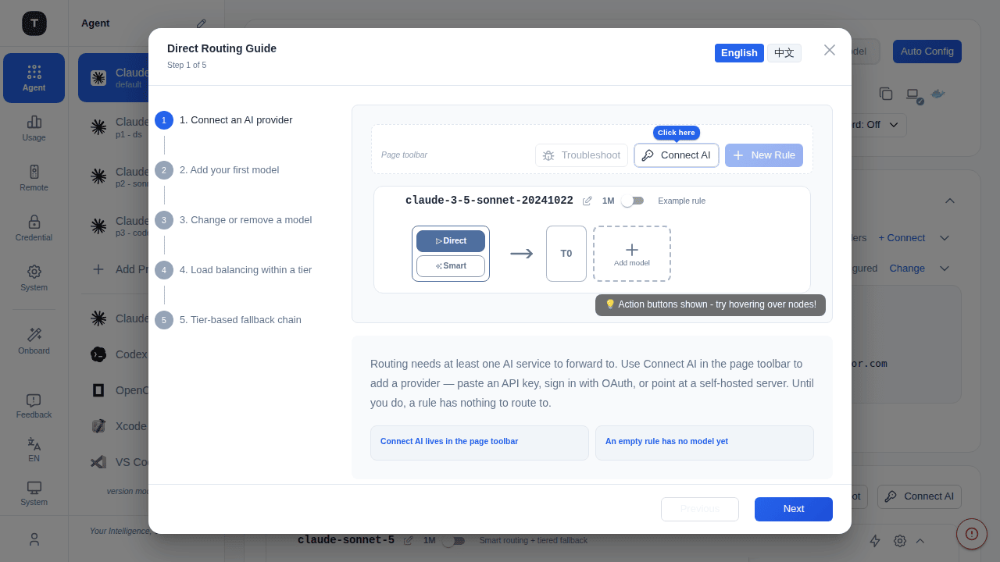
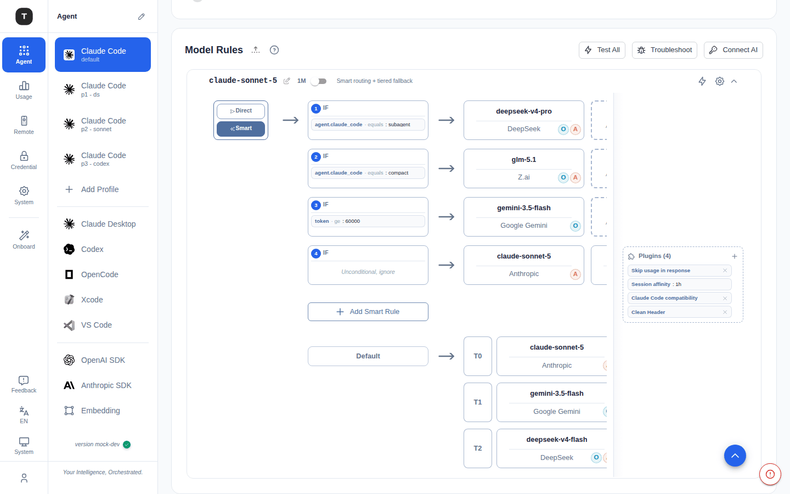
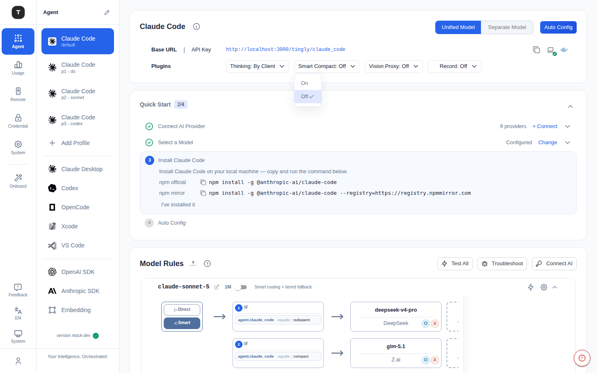
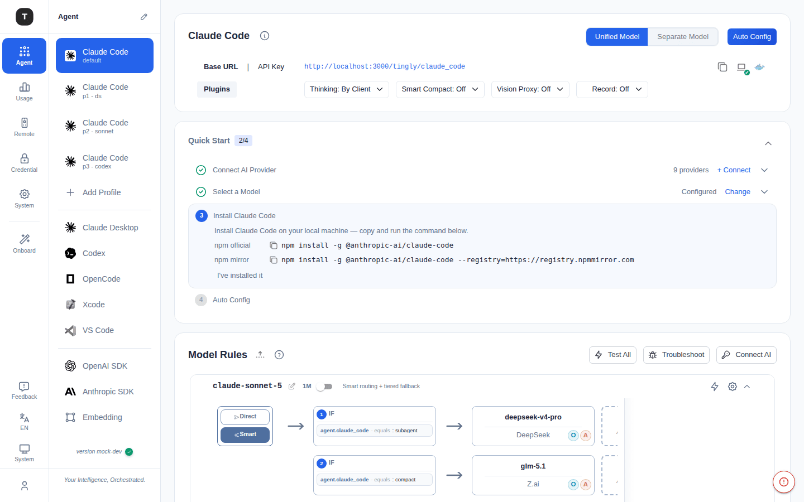

# 路由规则与插件标记

路径：`/scenario/*`（各场景页面中的规则卡片）

路由规则是 Tingly-Box 调度请求的核心机制。每条规则绑定一个请求模型（request_model），并决定如何将请求分发到一个或多个上游服务（Credential/Provider）。

---

## 首次使用引导



第一次进入任意场景页时，会**自动弹出一次**「Direct Routing Guide（直接路由引导）」，用图示分步讲解路由是怎么搭起来的——从零开始：**Connect AI 接入 Provider → ＋ Add model 加第一个模型 → 修改/删除模型 → 同层负载均衡 → 跨层熔断兜底**。

- 引导每位用户**只自动弹一次**，之后不再打扰
- 左侧是步骤导航，右侧是对应的路由图示意 + 文字说明；涉及工具栏按钮的步骤会显示一个高亮按钮的**模拟工具栏**，告诉你该点哪里
- 想再看时，点击工具栏右侧的 **?**（How routing works）按钮即可随时重新打开
- 底部 **Previous / Next** 翻页，最后一步是 **Got it!** 关闭

> 智能路由也有独立的 Smart Routing Guide，切换到 Smart 模式后通过同一个 **?** 按钮查看。

---

## 路由图总览



规则卡片中内嵌路由图，直观展示请求的流转路径。路由图有两种模式，通过规则卡片内的切换按钮在 **直接路由**（Direct）和 **智能路由**（Smart）之间切换。

---

## 直接路由（Direct / Tier 模式）

直接路由是默认模式（`lbTactic: "tier"`）。服务节点按优先级分层排列：

```
请求入口
  │
  ├── T0（最高优先级）：多个服务共享负载
  ├── T1：T0 整体熔断后的备用层
  └── T2：T1 熔断后的最终兜底
```

### 层级行为

| 概念 | 说明 |
|------|------|
| 同层服务 | 轮询或加权共享流量（负载均衡） |
| 跨层 Fallback | 当前层所有服务均熔断时，请求自动路由到下一层 |
| 层号（T0/T1…） | 数字越小优先级越高；拖拽服务节点可调整层级 |

### 熔断器（Circuit Breaker）

每个服务节点维护独立的熔断器，状态如下：

```
Closed（正常） ──── 连续 3 次失败 ──→ Open（熔断）
                                         │
                                    30 秒冷却期
                                         │
                                    HalfOpen（探针）
                                         │
                         ┌─── 成功 ───→ Closed（恢复）
                         └─── 失败 ───→ Open（重新熔断）
```

| 状态 | 含义 |
|------|------|
| **Closed** | 正常接收请求 |
| **Open** | 拒绝请求，等待冷却（默认 30 秒） |
| **HalfOpen** | 发送探针请求；成功则恢复，失败则重新熔断 |

### 请求中途 Failover（Mid-request Failover）

通过 `firstChunkGate` 缓冲机制（v2），在收到上游第一个响应块之前，若上游失败，请求可无缝切换到同层其他服务或下一层，对客户端透明。

---

## 智能路由（Smart Routing）



启用智能路由后（`smartEnabled: true`），规则链中的每条子规则（SmartOp）均可附带条件。请求按顺序匹配，**第一条所有条件均满足**的子规则生效。

```
请求入口
  │
  ├── SmartOp 1（条件 A AND 条件 B）── 满足 ──→ 路由到服务组 A
  ├── SmartOp 2（条件 C）           ── 满足 ──→ 路由到服务组 B
  └── SmartOp N（无条件，兜底）      ──────────→ 路由到默认服务组
```

### SmartOp 条件目录

| 条件键 | 类型 | 可选值 | 说明 |
|--------|------|--------|------|
| `agent.claude_code` | enum | `main` / `subagent` / `compact` | Claude Code 请求类型 |
| `token` | 阈值 | `ge:<N>` / `le:<N>` | 输入 Token 数量（大于等于/小于等于） |
| `thinking` | bool | `on` / `off` | 客户端是否开启了扩展思考 |
| `service_ttft` | 性能 | `fastest` / `fast` / `slow` / `slowest` | 上游服务首字节延迟（TTFT）性能档位 |
| `service_capacity` | 状态 | `available` / `degraded` / `unavailable` | 上游服务当前容量状态 |
| `context_system` | 存在性 | `exists` / `missing` | 请求是否携带 system prompt |
| `latest_user` | 内容类型 | `text` / `image` / `file` / `rich` | 最新一条 user 消息的内容类型 |

### 设计技巧

- 多个条件使用 **AND 逻辑**（同一 SmartOp 内所有条件均须满足）
- 最后一条子规则保持**无条件**（ops=[]），作为兜底默认路径
- 利用 `agent.claude_code=compact` 将 Compact 压缩请求路由到更便宜的模型
- 利用 `token ge:100000` 将超长上下文请求路由到支持大窗口的服务

---

## 规则插件标记（Rule Plugins）

每条规则右侧的 **Plugins** 卡片提供预制的附加标记（Flags），可在规则层面精调请求/响应行为，无需改动服务配置。

点击 Plugins 卡片，打开 **Flag 目录**（分类侧边栏 + 详情面板）。



### App 类

| 标记 | Key | 说明 |
|------|-----|------|
| Cursor compatibility | `cursor_compat` | 对 Cursor 客户端规范化富内容、封锁工具、去除 stream usage |
| Auto-detect Cursor | `cursor_compat_auto` | 根据请求头自动识别 Cursor 并应用兼容处理 |
| Claude Code compatibility | `claude_code_compat` | 将 messages 数组中 `system` 角色条目重写为 `user`，兼容不支持此扩展角色的第三方 Anthropic 兼容服务 |

### Request (OpenAI) 类

| 标记 | Key | 类型 | 说明 |
|------|-----|------|------|
| Custom User-Agent | `custom_user_agent` | 字符串 | 覆盖出向请求的 User-Agent 头（仅对通用 OpenAI/Anthropic 客户端生效；专属客户端如 Claude Code OAuth 保留自身 UA） |
| OpenAI endpoint override | `openai_endpoint_override` | 枚举 | 强制使用 Chat Completions 或 Responses API，覆盖 Provider 默认设置（仅 OpenAI 类服务） |
| Use max_completion_tokens | `use_max_completion_tokens` | 开关 | 将 `max_tokens` 重写为 `max_completion_tokens`，适用于 o1/o3/gpt-5 系列 |
| Use max_tokens (legacy) | `use_max_tokens` | 开关 | 将 `max_completion_tokens` 重写为 `max_tokens`，兼容较旧的 OpenAI 兼容服务 |
| Block tools | `block_tools` | 字符串 | 逗号分隔的工具名列表，在转发前从请求中移除（跨 OpenAI Chat/Responses/Anthropic/Google） |

### Response 类

| 标记 | Key | 类型 | 说明 |
|------|-----|------|------|
| Skip usage in response | `skip_usage` | 开关 | 从响应中剥离 `usage` 块（SSE 增量和最终 body 均处理） |

### Reasoning 类

| 标记 | Key | 类型 | 说明 |
|------|-----|------|------|
| Thinking | `thinking_effort` | 枚举 | 统一控制扩展思考：`By Client`（透传）/ `Off`（强制关闭）/ `Low`（~1K token）/ `Medium`（~5K）/ `High`（~20K）/ `Max`（~32K）。Anthropic 端映射为 `budget_tokens`，OpenAI 端映射为 `reasoning_effort` |

### Vision 类

| 标记 | Key | 类型 | 说明 |
|------|-----|------|------|
| Vision Proxy | `vision_proxy_service` | 服务引用 | 通过视觉模型描述图片，使纯文本下游模型也能处理含图请求。优先级高于场景级视觉代理 |

### Routing 类

| 标记 | Key | 类型 | 说明 |
|------|-----|------|------|
| Session affinity | `session_affinity` | 整数（秒） | 会话粘性 TTL（**规则级**）：同一会话在 TTL 内持续命中同一服务。0 表示禁用。内置 Claude Code、Claude Desktop、Codex 规则默认 1800 秒。通过 `metadata.user_id`、`X-Tingly-Session-ID` 请求头或客户端 IP 识别会话 |

---

## 相关页面

- [场景总览](./02-scenario-overview.md)
- [Claude Code 场景](./03-scenario-claude-code.md)
- [凭证管理](./08-credentials.md)
- [实验性功能](./19-experimental.md)
