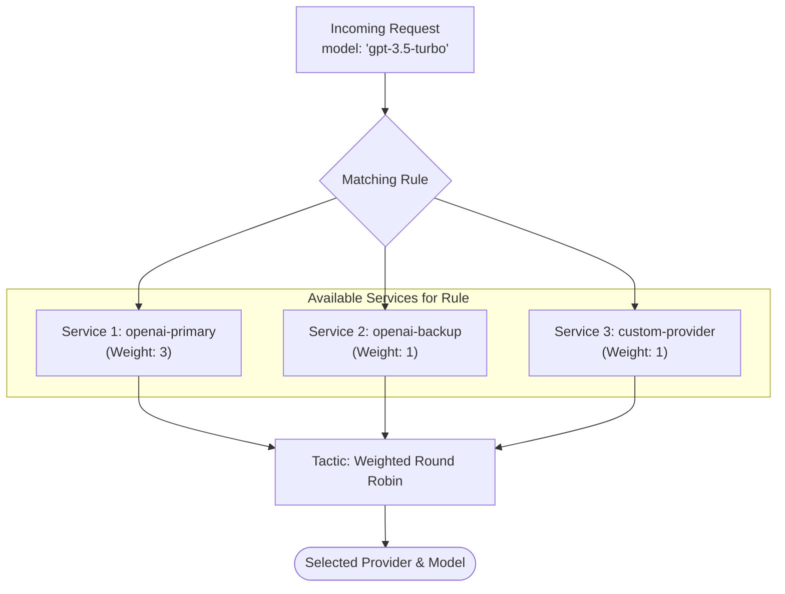

# Tingly Box User Manual

**Tingly Box** is a high-performance LLM proxy providing a unified OpenAI-compatible API for hundreds of model providers.

---

## 1. Installation & Setup

### Method 1: npx (Recommended)
Run directly without local installation (requires Node.js 18+):
```bash
npx tingly-box@latest start
# or install then run
npm install -g tingly-box
tingly-box start

```

### Method 2: Docker
Run as a background container:
```bash
# run the prebuild image
docker run -d \
  --name tingly-box \
  -p 12580:12580 \
  -v ~/.tingly-box:/app/.tingly-box \
  -v $(pwd)/logs:/app/logs \
  andreasfoo/tingly-box:latest

# or build for your own
docker build -t tingly-box:latest .
```

---

## 2. Authentication Strategy
Tingly Box uses two distinct JWT-based tokens. You can view yours by running `tingly-box token`.

| Token Type | Prefix | Target | Use Case |
| :--- | :--- | :--- | :--- |
| **User Token** | `tingly-user-` | Management API / UI | Accessing the dashboard and changing config. |
| **Model Token** | `sk-tingly-` | /openai and /anthropic | The API key you put into your Python/Node apps. |

---

## 3. Provider Management

Tingly Box supports two types of provider authentication:

| Type | How to Add | Description |
|:---|:---|:---|
| **API Key** | Web UI or CLI | Uses API tokens for authentication. Simple, works everywhere. |
| **OAuth** | Web UI only | Uses OAuth 2.0 flow for authentication. Works when API keys are unavailable. |

### Adding API Key Providers

#### Using CLI

```bash
# OpenAI example
tingly-box add openai https://api.openai.com/v1 sk-your-key

# Anthropic example
tingly-box add anthropic https://api.anthropic.com sk-your-key
```

#### Using Web UI

1. **Open the Web UI** at **http://localhost:12580**
2. **Navigate to the Providers page** and click the **"Add Provider"** button
3. **Fill in the provider details**:
   - Name: A unique identifier for this provider
   - API Base: The provider's API endpoint URL
   - API Style: Choose `openai` or `anthropic` based on the provider
   - Token: Your API key
4. **Click "Add"** to save the provider

### Adding OAuth Providers

OAuth providers can only be added through the Web UI, as they require an interactive authorization flow.

#### Available OAuth Providers

| Provider | Status | Description |
|:---|:---:|:---|
| **Claude Code** | ✅ Available | Anthropic Claude Code with full API access |
| **Gemini CLI** | 🔜 Coming Soon | Google Gemini models |
| **Qwen Code** | 🔜 Coming Soon | Alibaba Qwen models |


#### Adding an OAuth Provider

1. **Open the Web UI** at **http://localhost:12580**

2. **Navigate to the OAuth page** and click the **"Add Auth Provider"** button

3. **Select a provider** from the dialog (e.g., "Claude Code")

4. **Click "Authorize"** — a new browser window will open, redirecting you to the provider's OAuth authorization page (e.g., `https://claude.ai/oauth/authorize`)

5. **Complete the authorization flow** on the provider's site:
   - Log in to your account
   - Grant the requested permissions (e.g., `org:create_api_key`, `user:profile`, `user:inference`, `user:sessions:claude_code`)
   - Confirm authorization

6. **Automatic redirect** — after authorization, the provider redirects back to Tingly Box at `http://localhost:12580/callback`

7. **Provider created** — Tingly Box automatically:
   - Exchanges the authorization code for an access token
   - Creates a new provider with auto-generated name (e.g., `claude_code-a1b2c3`)
   - Stores the OAuth credentials securely
   - Displays a success confirmation

#### Managing OAuth Providers

Once added, OAuth providers appear in your provider list with special indicators:

- **Auth Type**: Displayed as "OAuth" instead of "API Key"
- **Token Management**: Access token, refresh token, and expiry time are stored
- **Auto-Refresh**: When the access token expires, Tingly Box automatically uses the refresh token to get a new one

OAuth providers work exactly like regular API key providers—you can use them in load balancing rules, call them via the unified endpoints, view token usage statistics, and delete them when no longer needed.

#### Security Notes

- The OAuth flow uses **PKCE** (Proof Key for Code Exchange) for enhanced security
- State parameters prevent CSRF attacks during the authorization flow
- Refresh tokens are stored separately and never exposed in API responses

### Supported API Styles

Tingly Box handles the translation between formats. If you add an Anthropic provider, you can still call it using the OpenAI SDK.

| Style | Description |
|:---|:---|
| **openai** | Standard JSON structure used by OpenAI, DeepSeek, Groq, etc. |
| **anthropic** | Specific message structure used by Claude models. |

---

## 4. Load Balancing & Rules
This is the core logic of Tingly Box. It maps a "virtual" model name to one or more "physical" providers.


### The Architecture
1. **Rule**: Matches an incoming `model` name (e.g., `gpt-4`).
2. **Service**: A list of actual providers attached to that rule.
3. **Tactic**: The logic used to choose between them.

### Tactic Types
| Tactic | Description |
| :--- | :--- |
| **Random** | Selects a provider based on assigned `weight`. |
| **Round Robin** | Cycles through providers every $N$ requests. |
| **Token-Based** | Distributes based on historical token usage (coming soon). |

---

## 5. Integration Examples

### OpenAI SDK (Python)
```python
from openai import OpenAI

client = OpenAI(
    api_key="sk-tingly-model-xxxx", # Your Model Token
    base_url="http://localhost:12580/openai/v1"
)

response = client.chat.completions.create(
    model="gpt-3.5-turbo",
    messages=[{"role": "user", "content": "Hello Tingly!"}]
)
```

### Claude Code Integration
To use Tingly Box with the Claude CLI tool, edit your `~/.claude/settings.json`:
```json
{
  "env": {
    "ANTHROPIC_AUTH_TOKEN": "sk-tingly-model-xxxx",
    "ANTHROPIC_BASE_URL": "http://localhost:12580/anthropic/v1",
    "ANTHROPIC_MODEL": "claude-3-5-sonnet-latest"
  }
}
```

## 6. Advanced Configuration

### Error Log Filtering
Configure `~/.tingly-box/global.json` to reduce log noise.
```json
{
  "error_log_filter_expression": "StatusCode >= 400 && Method != 'GET'"
}
```

### Files & Locations
* **Config**: `~/.tingly-box/config.json` (Provider data)
* **Stats**: `~/.tingly-box/state/stats.db` (SQLite DB of token usage)
* **Logs**: `~/.tingly-box/logs/bad_requests.log`

---

## 7. Troubleshooting

* **Server won't start?** Ensure port `12580` isn't taken. Use `tingly-box start --port 9000` to change it.
* **No models showing?** Check if your provider token is valid by testing it with a direct `curl` to the vendor.
* **401 Unauthorized?** You are likely using the **User Token** where the **Model Token** is required, or vice-versa.