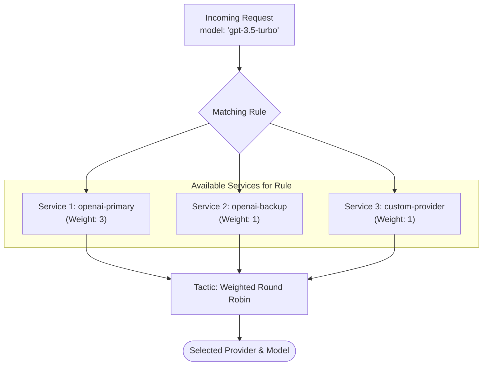

# Tingly Box User Manual

**Tingly Box** is a high-performance LLM proxy providing a unified OpenAI-compatible API for hundreds of model providers.

---

## 1. Installation & Setup

### Method 1: npx (Recommended)
Run directly without local installation (requires Node.js 18+):
```bash
npx tingly-box@latest start
# or install then run 
npm install -g tingly-box
tingly-box start

```

### Method 2: Docker
Run as a background container:
```bash
docker run -d \
  --name tingly-box \
  -p 12580:12580 \
  -v ~/.tingly-box:/app/.tingly-box \
  -v $(pwd)/logs:/app/logs \
  tingly-box:latest
```


---

## 2. Authentication Strategy
Tingly Box uses two distinct JWT-based tokens. You can view yours by running `tingly-box token`.

| Token Type | Prefix | Target | Use Case |
| :--- | :--- | :--- | :--- |
| **User Token** | `tingly-user-` | Management API / UI | Accessing the dashboard and changing config. |
| **Model Token** | `sk-tingly-` | /openai and /anthropic | The API key you put into your Python/Node apps. |

---

## 3. Provider Management

### Adding Providers
You can add providers via the **Web UI** (http://localhost:12580) or via **CLI**:

```bash
# OpenAI example
tingly-box add openai [https://api.openai.com/v1](https://api.openai.com/v1) sk-your-key

# Anthropic example
tingly-box add anthropic [https://api.anthropic.com](https://api.anthropic.com) sk-your-key
```

### Supported API Styles
Tingly Box handles the translation between formats. If you add an Anthropic provider, you can still call it using the OpenAI SDK.
* **openai**: Standard JSON structure used by OpenAI, DeepSeek, Groq, etc.
* **anthropic**: Specific message structure used by Claude models.

---

## 4. Load Balancing & Rules
This is the core logic of Tingly Box. It maps a "virtual" model name to one or more "physical" providers.


```mermaid
flowchart TD
    A[Incoming Request<br/>model: 'gpt-3.5-turbo'] --> B{Matching Rule}
    
    subgraph Services ["Available Services for Rule"]
        C1["Service 1: openai-primary<br/>(Weight: 3)"]
        C2["Service 2: openai-backup<br/>(Weight: 1)"]
        C3["Service 3: custom-provider<br/>(Weight: 1)"]
    end

    B --> C1
    B --> C2
    B --> C3

    C1 --> D[Tactic: Weighted Round Robin]
    C2 --> D
    C3 --> D

    D --> E([Selected Provider & Model])
```
### The Architecture
1. **Rule**: Matches an incoming `model` name (e.g., `gpt-4`).
2. **Service**: A list of actual providers attached to that rule.
3. **Tactic**: The logic used to choose between them.

### Tactic Types
| Tactic | Description |
| :--- | :--- |
| **Random** | Selects a provider based on assigned `weight`. |
| **Round Robin** | Cycles through providers every $N$ requests. |
| **Token-Based** | Distributes based on historical token usage (coming soon). |

---

## 5. Integration Examples

### OpenAI SDK (Python)
```python
from openai import OpenAI

client = OpenAI(
    api_key="sk-tingly-model-xxxx", # Your Model Token
    base_url="http://localhost:12580/openai/v1"
)

response = client.chat.completions.create(
    model="gpt-3.5-turbo",
    messages=[{"role": "user", "content": "Hello Tingly!"}]
)
```

### Claude Code Integration
To use Tingly Box with the Claude CLI tool, edit your `~/.claude/settings.json`:
```json
{
  "env": {
    "ANTHROPIC_AUTH_TOKEN": "sk-tingly-model-xxxx",
    "ANTHROPIC_BASE_URL": "http://localhost:12580/anthropic/v1",
    "ANTHROPIC_MODEL": "claude-3-5-sonnet-latest"
  }
}
```

---

### Oauth Integration


## 6. Advanced Configuration

### Error Log Filtering
Configure `~/.tingly-box/global.json` to reduce log noise.
```json
{
  "error_log_filter_expression": "StatusCode >= 400 && Method != 'GET'"
}
```

### Files & Locations
* **Config**: `~/.tingly-box/config.json` (Provider data)
* **Stats**: `~/.tingly-box/state/stats.db` (SQLite DB of token usage)
* **Logs**: `~/.tingly-box/logs/bad_requests.log`

---

## 7. Troubleshooting

* **Server won't start?** Ensure port `12580` isn't taken. Use `tingly-box start --port 9000` to change it.
* **No models showing?** Check if your provider token is valid by testing it with a direct `curl` to the vendor.
* **401 Unauthorized?** You are likely using the **User Token** where the **Model Token** is required, or vice-versa.